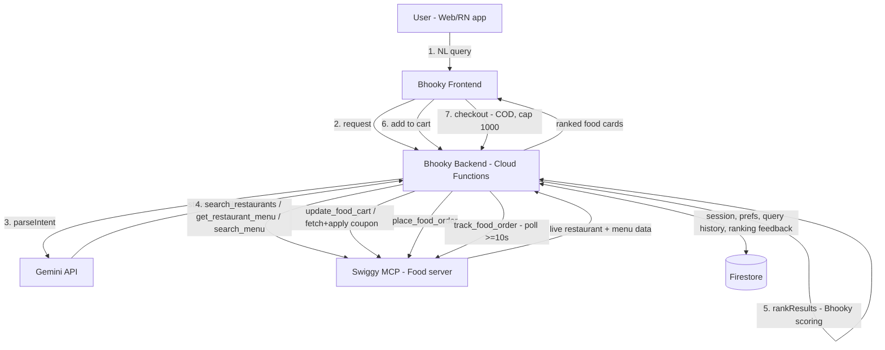

# Bhooky — Build Plan (Full Swiggy MCP Integration)

> Companion to `bhooky_project_context.md`. That doc describes the original vision (own dataset + deep-link redirect to Swiggy). This plan supersedes the integration approach: Bhooky will integrate directly with **Swiggy's official Builders Club MCP servers** — live restaurant/menu data, real cart management, and real order placement via OAuth — rather than a static dataset with a redirect fallback.

Scope decisions this plan is built on (confirmed with you):
- **Integration depth:** Full Swiggy MCP integration from day one (OAuth 2.1 PKCE, live tool calls, real orders).
- **Platform:** Web first (React), mobile second (React Native), sharing one backend.
- **Team:** Solo, full-time, fast-MVP pace.

---

## 1. Tech Stack

| Layer | Choice | Why |
|---|---|---|
| Web frontend | React + TypeScript + TailwindCSS + Vite | Matches original doc; Vite gives fast solo-dev iteration |
| Mobile frontend (Phase 4) | React Native (Expo) | Reuses TS types/logic from a shared package; Expo avoids native build overhead for a solo dev |
| Client state | Zustand | Lightweight cart/session state, no boilerplate |
| Backend | Firebase Cloud Functions (2nd gen, Node.js/TypeScript) | Same platform as Firestore/Auth; scales to zero; fits original doc |
| Database | Firestore | Bhooky-owned data only now (see §3) — restaurant/menu/offer data comes live from Swiggy, not stored here |
| AI | Gemini API, structured output / function-calling mode | Guarantees valid JSON intent schema instead of free-text parsing |
| Swiggy integration | `@modelcontextprotocol/sdk` (raw MCP client) in your Cloud Functions | You want your own ranking engine to decide what's shown, not an autonomous agent — so call MCP tools directly rather than handing orchestration to an agent framework |
| Auth (Swiggy) | OAuth 2.1 + PKCE against `mcp.swiggy.com` | Required by Swiggy MCP; see §7 |
| Auth (Bhooky account, optional) | Firebase Authentication | Lets a user's preferences/history persist across devices independent of the 5-day Swiggy session |
| Hosting region | GCP **`asia-south1` (Mumbai)** for Functions + Firestore + Hosting | Swiggy's DPDP compliance posture keeps data inside India/Singapore — hosting in Mumbai avoids needing a DPA + SCCs (see §9) |
| Error tracking | Sentry | Cloud Functions + web + RN all report here |
| CI/CD | GitHub Actions → Firebase deploy | Simple solo-dev pipeline |

**What changed vs. the original doc:** no separate "Restaurants / Menu Items / Offers" Firestore collections as primary data, and no Swiggy deep-link/redirect step — Swiggy MCP tool calls replace both.

---

## 2. System Architecture



OAuth is a separate side-channel: the user authorizes Bhooky against their own Swiggy account once (browser redirect + phone/OTP on Swiggy's side), Bhooky's backend holds the resulting bearer token server-side and uses it for every MCP call made on that user's behalf.

---

## 3. Data Model (Firestore)

Since restaurant/menu/offer data is now live from Swiggy, Firestore holds only what Swiggy doesn't provide:

- **`users`** — Bhooky profile (if using Firebase Auth), preferences, linked Swiggy session ref
- **`swiggy_sessions`** — encrypted bearer token + expiry (5 days), keyed by user; flag for "needs reconnect"
- **`queries`** — raw NL query + parsed intent JSON + timestamp (personalization/analytics seed data)
- **`ranking_feedback`** — which card a user clicked/ordered, used to tune the scoring weights over time
- **`carts`** — local staging cart for optimistic UI before syncing to Swiggy's cart via `update_food_cart`
- **`restaurant_cache`** *(optional, Phase 3)* — short-TTL cache (a few minutes) of `search_restaurants`/menu responses, keyed by `addressId + query hash`, purely to reduce MCP call volume against rate limits — never a source of truth

---

## 4. AI Layer (Gemini)

Unchanged in spirit from the original doc — Gemini only parses intent, never fetches results. Use **structured output / function-calling**, not prompt-and-hope, so the JSON is always valid:

```json
// Input: "something spicy, veg, under ₹300, late night"
{
  "food_type": "veg",
  "taste": "spicy",
  "budget": 300,
  "time": "late_night"
}
```

This structured object maps directly to `search_restaurants`/`search_menu` call parameters (query string + filters), not to a database query.

---

## 5. Ranking Engine

Same formula as the original doc, but every input now comes from a live Swiggy MCP response rather than Firestore:

```
score = (budget_match * 0.3) + (distance * 0.2) + (rating * 0.2) + (offer * 0.2) + (intent_match * 0.1)
```

Pipeline: `search_restaurants` + `get_restaurant_menu`/`search_menu` (raw Swiggy results) → normalize fields → apply weights → top-N → attach live offer data from `fetch_food_coupons` → return as Bhooky-branded food cards.

Build your **own** card UI from the raw tool-response data rather than Swiggy's embedded "widgets" (iframe UI fragments Swiggy MCP can also return) — the ranked, branded card grid is Bhooky's actual product differentiation. Revisit widgets later purely as a shortcut for the checkout/cart step if you want to offload that UI (see §8).

---

## 6. Swiggy Builders Club Onboarding — start this in Phase 0, not after

This is the critical path item because it gates real order placement, and it has a real turnaround time:

1. Build locally against Swiggy's dev/staging environment first (self-serve, no approval needed to start).
2. Implement OAuth 2.1 PKCE end-to-end and confirm you can call `get_addresses` successfully — this is your "hello world" milestone.
3. Record a demo video of a **real, working flow** (query → ranked results → cart → order) — Swiggy explicitly wants "a concrete use case with real end users, not a sandbox demo," so have a couple of real testers use it before recording.
4. Submit the application at `/access` (or email `builders@swiggy.in`) with: integration name/org, HTTPS redirect URIs (localhost OK for dev), target server (start with **Food** only), estimated orders/day and tool-calls/day, a one-paragraph use case, and a technical contact.
5. Staging credentials are issued during review.
6. Production access is granted after **≥48 hours of green staging performance** (low error rate, respecting rate limits) following submission.

Practical implication for your solo timeline: kick this off in Week 0 alongside Phase 1 build, so the ≥48h staging window and review overlap with your own development instead of blocking it.

---

## 7. OAuth 2.1 PKCE — implementation notes

1. Generate a PKCE code verifier (random 32 bytes, base64url) and its SHA-256 code-challenge.
2. Redirect the user to `https://mcp.swiggy.com/auth/authorize` with the challenge, client ID, redirect URI, state, and scopes (`mcp:tools mcp:resources mcp:prompts`).
3. User completes phone + OTP verification on Swiggy's own page (Bhooky never sees Swiggy credentials).
4. Your callback exchanges the returned code via `POST /auth/token` (code + verifier + redirect URI) → access token, **valid 5 days, no refresh token**.
5. Every MCP call sends `Authorization: Bearer <token>`.
6. **There is no silent refresh.** On any `401`, treat it as "re-run authorization" — never assume a cached session is still valid. Surface this to the user as "Reconnect your Swiggy account" rather than a hard error.
7. Store the token server-side only (Firestore field, encrypted, or Secret Manager) — never in browser localStorage, never logged in plaintext.

---

## 8. v1 Constraints to design around now (not later)

- **COD only.** No online payment through the MCP order path yet — say this plainly in the checkout UI.
- **₹1000 hard cap per order** on Builders Club orders — validate cart total client- and server-side, block checkout over the cap with a clear message.
- **No refresh tokens** — 5-day session, manual reconnect (see §7).
- **`place_food_order` is not idempotent** — on any 5xx, call `get_food_orders` to check whether the order actually went through *before* retrying, to avoid double orders.
- **Business-model note:** the pitch deck's affiliate-commission model assumed normal Swiggy checkout; COD-only MCP orders may not attribute the same way. Treat commission-based monetization as something to revisit with Swiggy once you're past the developer tier — don't block MVP scope on it. Premium/subscription features on Bhooky's own side (meal planning, personalization) are unaffected and can proceed independently.

---

## 9. Compliance (DPDP 2023)

- Swiggy is the Data Fiduciary; Bhooky is a **Data Processor** operating inside the user's existing Swiggy consent — the MCP layer doesn't expand what you're allowed to do with the data.
- Host all processing in **`asia-south1`** — Swiggy's infra stays inside India (failover Singapore) and explicitly avoids US/EU routing; matching your hosting region avoids needing a DPA + SCCs.
- Minimize retention to session-only; log session IDs, not full request/response bodies; hash user identifiers at rest; honor deletion requests within 30 days.
- No use of Swiggy-originated data for analytics, ads, or model training beyond direct product use, without separate explicit consent.

---

## 10. Rate Limits & Resilience

- Guidance figures (not yet enforced at MCP layer in v1.0, but design for them): **120 req/min** general, **30 req/min** writes, per user per server; burst 2× over 10s.
- Cache slow-changing data briefly (see `restaurant_cache`, §3); never poll `track_food_order` faster than every 10s.
- Exponential backoff on all upstream errors; separate interactive (user-facing) call paths from any background/analytics jobs so a batch job can't eat a user's interactive budget.

---

## 11. Phase-Wise Roadmap (solo, full-time, fast MVP)

### Phase 0 — Foundations & Swiggy access kickoff (~2–3 days)
- Repo setup: monorepo (`apps/web`, `apps/functions`, `packages/shared`), GCP project in `asia-south1`, Firebase project, Gemini API key.
- Get Swiggy MCP dev/staging credentials (self-serve); register a localhost redirect URI.
- Implement bare OAuth PKCE flow against staging; success criterion: a working call to `get_addresses`.
- Start drafting the "real use case" story for the eventual access application — it sharpens MVP scope now.

### Phase 1 — Core AI search MVP, web, read-only (~2 weeks)
- Chat/search UI: input box, filter chips, food card grid (React + Tailwind).
- `parseIntent` function (Gemini, structured output).
- `searchFood` function: parsed intent → `search_restaurants` + `get_restaurant_menu`/`search_menu` (staging) → normalized results.
- `rankResults` function (§5 formula, v1 weights).
- Log every query + parsed intent to Firestore `queries` (personalization seed data).
- No cart/order yet. Milestone: this is the demo you record for the Builders Club application.

### Phase 2 — Cart, coupons, real orders (staging) + submit for production access (~2 weeks)
- `update_food_cart`, `fetch_food_coupons` / `apply_food_coupon`, `get_food_cart`, `place_food_order` (COD), `track_food_order`.
- Cart UI mirrors Swiggy's cart state; enforce the ₹1000 cap and COD-only messaging in the UI.
- 401 → "reconnect Swiggy account" UX; retry-with-backoff; idempotency check via `get_food_orders` before any retry of `place_food_order`.
- Submit the Builders Club production access application once this flow is stable end-to-end with real testers.

### Phase 3 — Production cutover, ranking refinement, polish (~2 weeks)
- Swap staging → production credentials once approved.
- `ranking_feedback` loop: log clicks/orders, adjust scoring weights.
- Add `restaurant_cache` (short TTL) to cut MCP call volume and improve latency.
- Monitoring: Sentry + Cloud Monitoring dashboards for MCP error rate/latency.
- UI polish: loading/empty states, offer badges, distance/time chips.

### Phase 4 — Mobile app, React Native/Expo (~3 weeks)
- Extract shared types/schemas/ranking constants into `packages/shared`.
- Rebuild the screens in RN against the same backend endpoints (no backend changes needed).
- Mobile OAuth via in-app browser (ASWebAuthenticationSession/Custom Tabs) redirecting back through a deep link.
- App store prep: icons, screenshots, privacy policy reflecting Swiggy data use + DPDP posture.

### Phase 5 — Scale & future scope (ongoing)
- Consider Instamart/Dineout MCP servers for combined use cases ("plan my evening").
- Location-based search refinement, saved-address UX.
- Original future-scope items become reachable: voice ordering, AI meal planning, subscriptions — these are Bhooky-side features, independent of Swiggy's payment constraints.
- Revisit affiliate/commission monetization with Swiggy once past developer tier.

---

## 12. Updated Risks

- **Approval-timeline dependency** — mitigated by starting Phase 0's access process immediately, in parallel with Phase 1 build.
- **COD-only + ₹1000 cap** limit real-world usefulness until Swiggy raises v1 limits — communicate this transparently rather than over-promising.
- **No refresh token** → recurring reconnect friction every 5 days — design a gentle, non-alarming reminder rather than a hard error state.
- **Data residency** — solved by hosting in `asia-south1`, but re-check if you ever add non-India infra.
- **Rate limits at scale** — caching and backoff need to be in place before any real growth push, not bolted on after.
- **Non-idempotent order placement** — must be engineered carefully (see §8) to avoid double-charging a real user.
