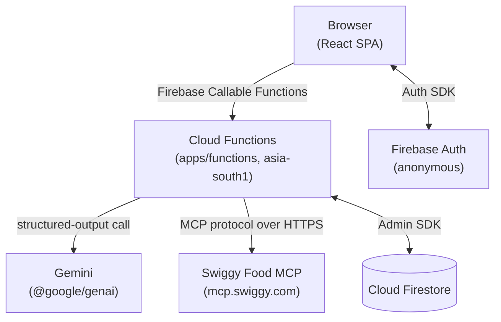
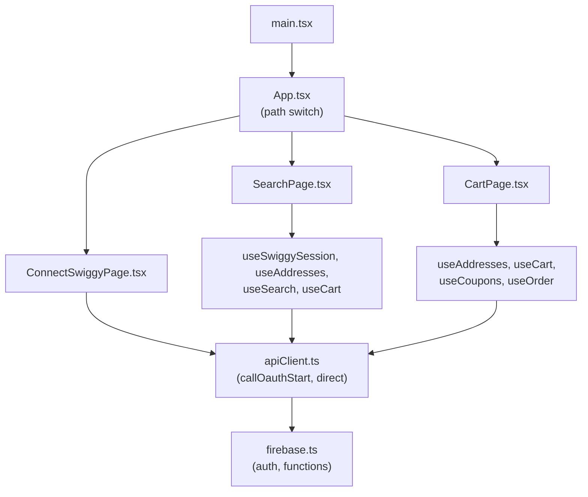
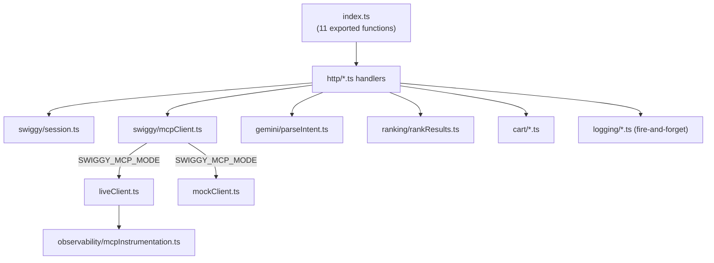
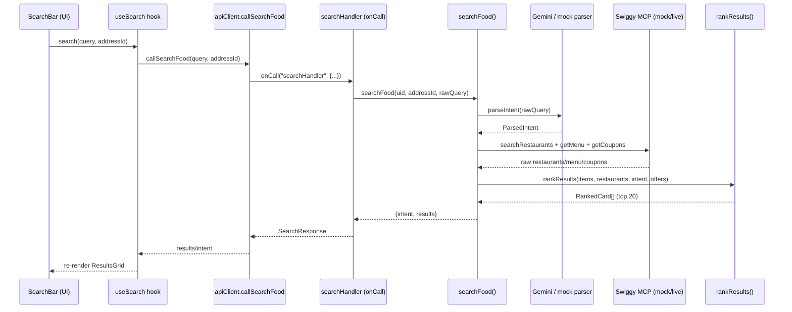
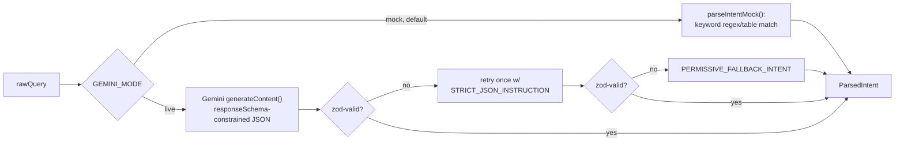
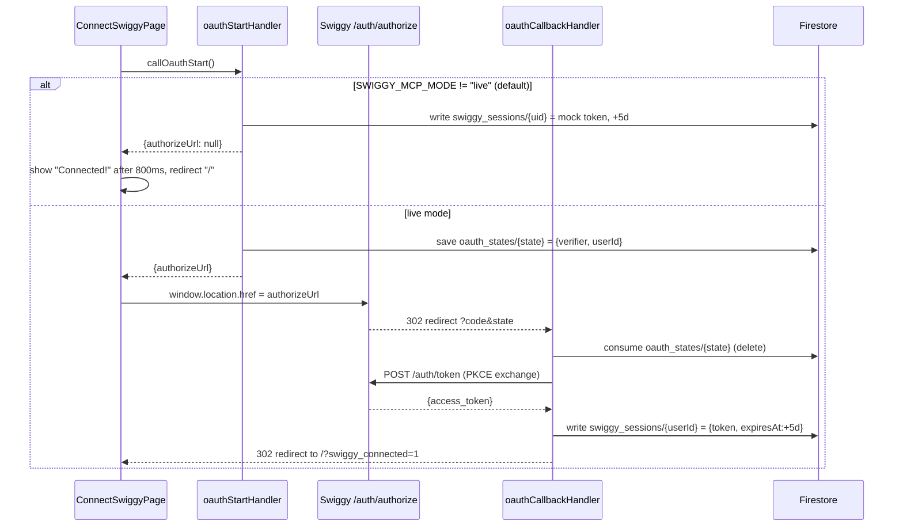
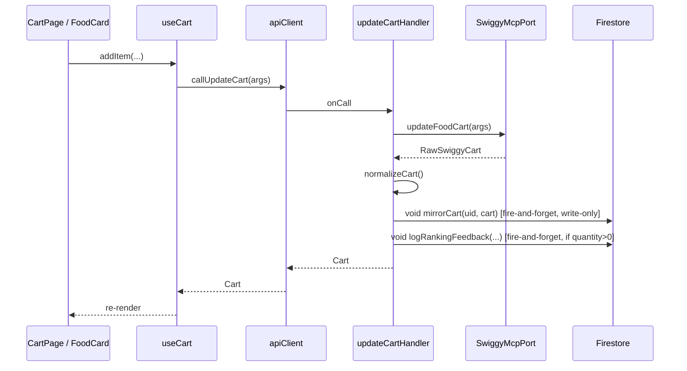

# Bhooky — Technical Source of Truth

> Generated by reverse-engineering the actual source code in this repository (not from prior docs, plans, or comments alone). Every claim below is labeled **IMPLEMENTED**, **PARTIALLY IMPLEMENTED**, **MOCKED**, **PLACEHOLDER**, **UNUSED**, or **PLANNED / NOT IMPLEMENTED**, and cites the file(s)/line(s) it's derived from. Where prior docs (`README.md`, `BHOOKY_BUILD_PLAN.md`, `bhooky_project_context.md`, `plans/*.md`) disagree with the code, the code wins — disagreements are called out explicitly in §2 and §32.
>
> Snapshot basis: HEAD `14372635` on `main`, working tree as of 2026-08-31. Compiled output under `apps/functions/lib/` was **not** treated as source — only `apps/functions/src/`, `apps/web/src/`, and `packages/shared/src/` are authoritative.

---

## 1. Executive Overview

Bhooky is a **food-search-and-ordering demo web app** that lets a user type a natural-language query ("something spicy vegetarian under 300 for late night"), have that query parsed into structured filters by Gemini, search Swiggy's restaurant/menu catalog through Swiggy's **Food MCP** server, re-rank the results with Bhooky's own scoring formula, and then add items to a cart, apply a coupon, and place a Cash-on-Delivery order — with order-status tracking afterward.

**Main actors**
- **The end user** — an anonymous browser session (no real account system; see §16).
- **Bhooky's frontend** (`apps/web`) — a React SPA that renders search, cart, and Swiggy-connect screens.
- **Bhooky's backend** (`apps/functions`) — Firebase Cloud Functions (2nd gen, region `asia-south1`, `apps/functions/src/index.ts:7`) that own all business logic: intent parsing, Swiggy MCP calls, ranking, cart math, order placement.
- **Gemini** (`@google/genai`) — parses the raw query into `{food_type, taste, budget, time}`. Mocked by default.
- **Swiggy's Food MCP server** (`https://mcp.swiggy.com`, via `@modelcontextprotocol/sdk`) — the actual restaurant/menu/cart/coupon/order data source and the actual order executor. Mocked by default.
- **Firestore** — stores Swiggy session tokens, OAuth CSRF state, a short-TTL restaurant/menu cache, an optimistic cart mirror, and two append-only analytics logs (`queries`, `ranking_feedback`). It is **not** used as Bhooky's own restaurant/menu database — Swiggy MCP is the data source (see §2, contradicting an earlier planning doc).

**Main user journey**: user opens the app → gets an anonymous Firebase Auth session automatically → connects a (mock) Swiggy session → picks a delivery address → types a query → sees ranked food cards → adds an item to cart → optionally applies a coupon → checks out (COD, capped at ₹1000) → watches order status progress.

**Technologies**
- **Frontend**: React 19 + Vite 8 + TypeScript 7, Tailwind CSS v4 (via `@tailwindcss/vite`), Firebase JS SDK v12 (Auth + Callable Functions client). No router library — a hand-rolled `window.location.pathname` switch (`apps/web/src/App.tsx`). No client state library — plain React hooks.
- **Backend**: Firebase Cloud Functions v2 (`firebase-functions ^7.3.0`, Node 20), `firebase-admin` for Firestore, `zod` for request validation, `@google/genai` for Gemini, `@modelcontextprotocol/sdk` for Swiggy MCP.
- **Shared package**: `@bhooky/shared` (`packages/shared`) — TypeScript types/interfaces and two constant modules (ranking weights, order limits), consumed by both apps via an npm workspace + TypeScript project-reference build.
- **Database**: Cloud Firestore, locked down by security rules to server-only access (§14, §20).
- **Deployment**: Firebase Hosting (static SPA) + Cloud Functions, all defined in one `firebase.json`; local dev runs entirely on the Firebase Emulator Suite with zero external credentials needed by default.

**One-paragraph architecture**: A user action in the React SPA calls one function in `apps/web/src/lib/apiClient.ts`, which is the sole network boundary and invokes a Firebase Callable Function by name; that callable (defined in `apps/functions/src/http/*.ts`) validates the request with `zod`, authenticates the caller via `requireUid()`, loads the user's Swiggy session token from Firestore, obtains a `SwiggyMcpPort` (either a real MCP client or an in-memory mock, chosen by `SWIGGY_MCP_MODE`), does its business logic (search/rank, cart math, order placement with idempotency-safe retry), optionally logs analytics to Firestore fire-and-forget, and returns a typed response defined in `@bhooky/shared`; the frontend hook that made the call updates React state, and the corresponding page re-renders.

---

## 2. Current Implementation Status

| Area | Status | Evidence / Location | Notes |
|---|---|---|---|
| Authentication | IMPLEMENTED (anonymous only) | `apps/web/src/lib/firebase.ts:24-38` (`signInAnonymously`); `apps/functions/src/http/handlerUtils.ts:7-12` (`requireUid`) | No email/password/social login. "Phase 1 has no account system, just a stable per-browser identity" (`firebase.ts` comment). |
| AI intent parsing | IMPLEMENTED, MOCKED by default | `apps/functions/src/gemini/parseIntent.ts`, `parseIntentMock.ts` | `GEMINI_MODE` env var, default `"mock"` (`parseIntent.ts:31`). Live path calls real Gemini structured output. |
| Food search | IMPLEMENTED | `apps/functions/src/search/searchFood.ts` | Full pipeline: session → intent → Swiggy search → menu/coupon fan-out → normalize → rank → log. |
| Restaurant search | IMPLEMENTED, MOCKED by default | `apps/functions/src/swiggy/searchRestaurants.ts`, `mockClient.ts` | Backed by `SwiggyMcpPort.searchRestaurants`; mock returns 21 fixture restaurants (`dummy-data/restaurants.ts`). |
| Menu | IMPLEMENTED, MOCKED by default | `apps/functions/src/swiggy/getMenu.ts` | Bounded-concurrency (3 workers) fan-out over candidate restaurants, cached 3 min. |
| Cart | IMPLEMENTED, MOCKED by default | `apps/functions/src/http/{getCartHandler,updateCartHandler}.ts`, `cart/*.ts`, `apps/web/src/hooks/useCart.ts`, `pages/CartPage.tsx` | Mock client simulates real per-token cart state (single restaurant at a time). |
| Checkout | IMPLEMENTED (COD only), capped | `apps/functions/src/http/orderHandler.ts`, `orders/orderRetry.ts`, `cart/cartTotals.ts::isOverOrderCap` | ₹1000 hard cap re-validated server-side against a fresh Swiggy cart fetch. Non-idempotent `place_food_order` handled via check-before-retry. |
| Swiggy integration | PARTIALLY IMPLEMENTED (live path unverified) | `apps/functions/src/swiggy/{types,liveClient,mockClient,mcpClient}.ts` | Real MCP client code exists and is architecturally complete, but per its own comments has "never run against a real Swiggy response" (`liveClient.ts:26-33`, `types.ts:12-19`). |
| OAuth | IMPLEMENTED (PKCE), bypassed in mock mode | `apps/functions/src/swiggy/oauth/*.ts`, `http/{oauthStartHandler,oauthCallbackHandler}.ts` | Real OAuth 2.1 + PKCE (S256) flow exists; short-circuited entirely when `SWIGGY_MCP_MODE !== "live"`. No refresh token — flat 5-day expiry. |
| Location | MOCKED / minimal | `apps/functions/src/swiggy/searchRestaurants.ts`; `dummy-data/restaurants.ts` (`distanceKm` fixture field) | No client-side geolocation capture found; "distance" comes from an address ID passed to Swiggy (or a hardcoded mock field), not a Bhooky-computed geo calculation. |
| Firestore | IMPLEMENTED | `firestore.rules`, `apps/functions/src/firebaseAdmin.ts` | 7 collections defined in rules (all deny-all to clients); only 6 are actually read/written by code — see §14. |
| Ranking | IMPLEMENTED | `apps/functions/src/ranking/rankResults.ts`, `packages/shared/src/constants/rankingWeights.ts` | Weighted formula, 20-result cap, fully unit-tested (`rankResults.test.ts`). |
| Offers | IMPLEMENTED, MOCKED by default | `apps/functions/src/ranking/offerScore.ts`, `swiggy/getCoupons.ts` | Uses a hardcoded `REFERENCE_ORDER_VALUE_RUPEES = 300` placeholder pending live coupon data. |

---

## 3. Repository / Folder Structure

```text
bhooky/
├── apps/
│   ├── functions/                  # Firebase Cloud Functions backend (Node/TS)
│   │   ├── src/
│   │   │   ├── index.ts            # Entry point — exports every deployed cloud function
│   │   │   ├── firebaseAdmin.ts    # Admin SDK singleton (db)
│   │   │   ├── http/               # One file per onCall/onRequest handler
│   │   │   ├── gemini/             # Intent parsing (live + mock)
│   │   │   ├── search/             # Search pipeline + raw→normalized mapping
│   │   │   ├── ranking/            # Scoring formula
│   │   │   ├── cart/               # Cart math, normalization, Firestore mirror
│   │   │   ├── addresses/          # Address normalization
│   │   │   ├── orders/             # Idempotency-safe order placement retry
│   │   │   ├── logging/            # Fire-and-forget analytics writes
│   │   │   ├── observability/      # Structured MCP-call logging
│   │   │   ├── swiggy/             # Swiggy MCP client (live + mock) + OAuth
│   │   │   └── dummy-data/         # Mock fixture data (restaurants, menus, coupons, addresses, keyword tables)
│   │   ├── scripts/                # One-off CLI scripts (seed, ranking analysis)
│   │   └── lib/                    # COMPILED OUTPUT (tsc), not source — git-tracked but not authoritative
│   └── web/                        # React SPA frontend (Vite)
│       └── src/
│           ├── pages/               # SearchPage, CartPage, ConnectSwiggyPage
│           ├── components/          # Presentational components
│           ├── hooks/                # One hook per backend callable/resource
│           └── lib/                  # firebase.ts (SDK init), apiClient.ts (callable wrappers)
├── packages/
│   └── shared/                     # @bhooky/shared — cross-app types + constants
│       └── src/
│           ├── types/               # address, cart, coupon, intent, order, ranking, restaurant, search
│           └── constants/            # rankingWeights.ts, orderLimits.ts
├── plans/                          # phase-1-plan.md, phase-2-plan.md (planning docs, not code)
├── firebase.json / .firebaserc / firestore.rules / firestore.indexes.json
├── tsconfig.base.json / tsconfig.json   # TypeScript project-reference root
├── package.json                   # npm workspaces root
├── README.md / BHOOKY_BUILD_PLAN.md / bhooky_project_context.md / llms.txt
└── graphify-out/                  # Generated knowledge-graph artifacts (not app runtime code)
```

### Directory notes

- **`apps/functions/src/http/`** — the entire server-side API surface. Runs server-side only (Cloud Functions runtime). Every file here is imported by `index.ts` and nowhere else.
- **`apps/functions/src/swiggy/`** — the only code that talks to Swiggy. Runs server-side. `oauth/` is a sub-module used only by `oauthStartHandler`/`oauthCallbackHandler`.
- **`apps/functions/src/dummy-data/`** — pure data, no logic; imported exclusively by `swiggy/mockClient.ts` and `gemini/parseIntentMock.ts`.
- **`apps/web/src/lib/`** — the frontend's entire network + SDK boundary. `apiClient.ts` is imported by every hook; `firebase.ts` is imported only by `apiClient.ts`.
- **`apps/web/src/hooks/`** — one hook per backend resource, each wrapping one or more `apiClient.ts` functions in React state. Runs client-side (browser).
- **`packages/shared/src/`** — pure type/constant definitions, zero runtime logic beyond a few zod schemas. Compiled at build time (`tsc -b`) and consumed by both other packages via TypeScript project references — this directory runs during the **build**, not at runtime in either app directly (its compiled output is imported at runtime).
- **`apps/functions/lib/`** — compiled JS from `apps/functions/src/`. Present in the working tree but is a build artifact; it was excluded from analysis per this document's sourcing rules.
- **`graphify-out/`** — output of a knowledge-graph tool (`/graphify`) run against this repo for navigation; not part of the application.

---

## 4. Complete File Inventory

Only files that affect application behavior are listed (trivial `.d.ts`/`.map` compiled output is omitted).

### `apps/functions/src/index.ts`
- Purpose: single entry point; the only file Firebase actually deploys from.
- Exports: re-exports all 11 cloud functions listed in §11/§23.
- Side effect: `setGlobalOptions({ region: "asia-south1" })` (line 7) — applies to every exported function; no per-function overrides exist.
- Active runtime code: yes, this is the deployed unit.

### `apps/functions/src/firebaseAdmin.ts`
- Purpose: Firebase Admin SDK singleton.
- Exports: `db` (Firestore instance).
- Guards `getApps().length === 0` before `initializeApp()`.
- Imported by: nearly every module that touches Firestore (`cart/mirrorCart.ts`, `swiggy/session.ts`, `swiggy/restaurantCache.ts`, `logging/*.ts`, `http/oauth*.ts`, `swiggy/oauth/oauthState.ts`).

### `apps/functions/src/http/handlerUtils.ts`
- Purpose: shared cross-handler helpers.
- Exports: `requireUid(request)`, `parseRequest(schema, data, message)`, `withSwiggyReconnect(fn)`.
- Called by: every handler in `http/` except `oauthCallbackHandler.ts` (has no Firebase Auth context by design).

### `apps/functions/src/http/searchHandler.ts` / `sessionStatusHandler.ts` / `getAddressesHandler.ts` / `getCartHandler.ts` / `updateCartHandler.ts` / `getCouponsHandler.ts` / `applyCouponHandler.ts` / `orderHandler.ts` / `trackOrderHandler.ts` / `oauthStartHandler.ts` / `oauthCallbackHandler.ts`
- Purpose: one exported Cloud Function per file; full detail in §11.
- All active runtime code, all re-exported from `index.ts`.

### `apps/functions/src/gemini/geminiClient.ts`
- Purpose: lazy singleton `GoogleGenAI` client.
- Exports: `getGeminiClient()`.
- Reads env: `GEMINI_API_KEY`.

### `apps/functions/src/gemini/parseIntent.ts`
- Purpose: mock/live dispatcher + real Gemini structured-output call, with retry and permissive fallback.
- Exports: `parseIntent(rawQuery)`.
- Calls: `getGeminiClient()`, `parseIntentMock()` (when mocked), `ParsedIntentFieldsSchema.safeParse` (from `@bhooky/shared`).
- Called by: `search/searchFood.ts`.

### `apps/functions/src/gemini/parseIntentMock.ts`
- Purpose: zero-network keyword-based intent parser.
- Exports: `parseIntentMock(rawQuery)`.
- Calls: keyword tables from `dummy-data/intents.ts`.
- Called by: `parseIntent.ts` when not in live mode.

### `apps/functions/src/search/searchFood.ts`
- Purpose: the entire search pipeline orchestrator (see §13, §7 Journey B).
- Exports: `searchFood(userId, addressId, rawQuery)`.
- Calls: `swiggy/session.ts`, `gemini/parseIntent.ts`, `swiggy/mcpClient.ts`, `swiggy/searchRestaurants.ts`, `swiggy/getMenu.ts`, `swiggy/getCoupons.ts`, `search/normalize.ts`, `ranking/{offerScore,rankResults}.ts`, `logging/logQuery.ts`.
- Called by: `http/searchHandler.ts`.

### `apps/functions/src/search/normalize.ts`
- Purpose: maps raw Swiggy shapes to Bhooky's normalized shapes.
- Exports: `normalizeRestaurant(raw)`, `normalizeMenuItem(raw, restaurantId)`, `estimatePriceRangeFromCostForTwo(costForTwo)`.
- Called by: `search/searchFood.ts`.

### `apps/functions/src/ranking/offerScore.ts`
- Purpose: converts a restaurant's coupons into a 0–1 offer sub-score.
- Exports: `computeOfferScore(coupons)`, `findBestOfferCoupon(coupons)`.
- Called by: `search/searchFood.ts`.

### `apps/functions/src/ranking/rankResults.ts`
- Purpose: the core scoring/ranking algorithm (full formula in §13).
- Exports: `rankResults(menuItems, restaurants, intent, offerScoresByRestaurantId?, bestOfferByRestaurantId?)`.
- Imports constants from `@bhooky/shared`: `RANKING_WEIGHTS`, `NEUTRAL_OFFER_SCORE`, `MAX_RANKED_RESULTS`.
- Called by: `search/searchFood.ts`.

### `apps/functions/src/cart/cartTotals.ts`
- Purpose: cart total math + coupon-applicability + order-cap check.
- Exports: `computeCartTotals(items, coupon)`, `isCouponApplicable(coupon, subtotal)`, `isOverOrderCap(total)`.
- Called by: `http/getCouponsHandler.ts`, `http/orderHandler.ts`, `swiggy/mockClient.ts`.

### `apps/functions/src/cart/normalizeCart.ts` / `normalizeCoupon.ts`
- Purpose: 1:1 field mapping from raw Swiggy shapes to `@bhooky/shared` `Cart`/`Coupon` shapes.
- Called by: every `http/` handler that touches cart/coupons.

### `apps/functions/src/cart/mirrorCart.ts`
- Purpose: fire-and-forget optimistic write of the cart to Firestore `carts/{uid}` — never read back by any handler; purely a "prime next load" side effect.
- Called by: `http/updateCartHandler.ts`, `http/applyCouponHandler.ts` (both via `void mirrorCart(...)`).

### `apps/functions/src/addresses/normalizeAddress.ts`
- Purpose: maps raw Swiggy address to `@bhooky/shared` `Address`.
- Called by: `http/getAddressesHandler.ts`.

### `apps/functions/src/logging/logQuery.ts` / `logRankingFeedback.ts`
- Purpose: fire-and-forget analytics writes (`queries`, `ranking_feedback` collections); errors caught and swallowed, never rethrown.
- Called by: `search/searchFood.ts` (`logQuery`), `http/updateCartHandler.ts` and `http/orderHandler.ts` (`logRankingFeedback`).

### `apps/functions/src/observability/mcpInstrumentation.ts`
- Purpose: wraps an async MCP call with timing + structured `logger.info`/`logger.error`.
- Exports: `instrumentMcpCall(toolName, fn)`.
- Called by: `swiggy/liveClient.ts` (every port method).

### `apps/functions/src/orders/orderRetry.ts`
- Purpose: idempotency-safe order placement retry loop (full detail §11, §31).
- Exports: `placeOrderWithIdempotencyCheck(port, args)`.
- Called by: `http/orderHandler.ts`.

### `apps/functions/src/swiggy/types.ts`
- Purpose: `SwiggyMcpPort` interface + every `Raw*` request/response shape. Explicitly documented as a "best-guess placeholder" pending real Swiggy verification (line 12-19).
- Implemented by: `LiveSwiggyMcpClient`, `MockSwiggyMcpClient`.

### `apps/functions/src/swiggy/mcpClient.ts`
- Purpose: 3-line factory choosing live vs. mock client via `SWIGGY_MCP_MODE`.
- Exports: `getSwiggyMcpClient(bearerToken)`.
- Called by: every `http/` handler and `search/searchFood.ts`.

### `apps/functions/src/swiggy/liveClient.ts`
- Purpose: real MCP protocol client over `@modelcontextprotocol/sdk`, talking to `https://mcp.swiggy.com` (or `SWIGGY_MCP_BASE_URL`).
- Exports: `LiveSwiggyMcpClient` (implements `SwiggyMcpPort`).
- Status: architecturally complete, "unexercised until real Builders Club staging credentials exist" (own comment).

### `apps/functions/src/swiggy/mockClient.ts`
- Purpose: full in-memory simulation of a Swiggy account — cart state, order status progression by elapsed time, coupon validation.
- Exports: `MockSwiggyMcpClient` (implements `SwiggyMcpPort`).
- Reads: `dummy-data/{restaurants,addresses,coupons}.ts`.
- Default client when `SWIGGY_MCP_MODE` unset.

### `apps/functions/src/swiggy/mockToken.ts`
- Purpose: deterministic per-uid fake bearer token, `` `mock-swiggy-token:${uid}` ``.
- Called by: `http/oauthStartHandler.ts` (mock branch), `scripts/seedSwiggySession.ts`.

### `apps/functions/src/swiggy/session.ts`
- Purpose: Swiggy session lifecycle against Firestore `swiggy_sessions/{uid}`.
- Exports: `getValidSwiggySession`, `invalidateSwiggySession`, `isSwiggyUnauthorizedError`, `getSwiggySessionStatus`, `SwiggySessionExpiredError`.
- `invalidateSwiggySession`/`isSwiggyUnauthorizedError` are called only from `http/orderHandler.ts`'s catch block — the only handler that actively invalidates a session on a detected 401.

### `apps/functions/src/swiggy/restaurantCache.ts`
- Purpose: Firestore-backed 3-minute-TTL cache in front of any Swiggy MCP call.
- Exports: `getOrFetch(cacheKey, fetchFn)`.
- Called by: `swiggy/searchRestaurants.ts`, `swiggy/getMenu.ts`, `swiggy/getCoupons.ts`.

### `apps/functions/src/swiggy/searchRestaurants.ts` / `getMenu.ts` / `getCoupons.ts`
- Purpose: intent-to-query translation (search), bounded-concurrency (3 workers) fan-out fetches for menu/coupons across candidate restaurants, all cached via `restaurantCache.ts`.
- Called by: `search/searchFood.ts`.

### `apps/functions/src/swiggy/oauth/pkce.ts` / `oauthState.ts` / `authorizeUrl.ts` / `exchangeToken.ts`
- Purpose: full OAuth 2.1 + PKCE (S256) implementation — code verifier/challenge generation, CSRF-safe single-use state storage (Firestore `oauth_states`), authorize-URL construction, and token exchange (`fetch()` POST to `/auth/token`).
- Called by: `http/oauthStartHandler.ts` (pkce, authorizeUrl, oauthState-save), `http/oauthCallbackHandler.ts` (oauthState-consume, exchangeToken).

### `apps/functions/src/dummy-data/*.ts`
- Purpose: static fixture data (21 mock restaurants + menus, 2 mock coupons, 2 mock addresses, keyword tables for the mock intent parser).
- Consumed exclusively by: `swiggy/mockClient.ts`, `gemini/parseIntentMock.ts`.

### `apps/functions/scripts/seedSwiggySession.ts` / `analyzeRankingFeedback.ts`
- Purpose: CLI utilities run via `tsx` against the Firestore emulator — seed a mock Swiggy session for a given uid; compute average ranking-feedback signal per score factor and suggest (never auto-apply) weight nudges.
- Not part of the deployed app; developer tooling only.

### `apps/web/src/main.tsx` / `App.tsx`
- Purpose: React DOM entry + manual path-based route dispatcher (`/`, `/cart`, `/connect-swiggy`).
- No router library; navigation is via full-page `<a href>`/`window.location.href`.

### `apps/web/src/lib/firebase.ts`
- Purpose: Firebase app/auth/functions bootstrap; anonymous sign-in; emulator wiring in dev.
- Exports: `auth`, `functions`, `authReady` (a Promise).
- Imported only by `apiClient.ts`.

### `apps/web/src/lib/apiClient.ts`
- Purpose: the sole network boundary — 10 callable wrapper functions, uniform reconnect-error normalization.
- Exports: `SwiggyReconnectRequiredError`, `callWithReconnectHandling`, `isReconnectRequiredError`, and `callSearchFood/callSessionStatus/callGetAddresses/callGetCart/callUpdateCart/callFetchCoupons/callApplyCoupon/callPlaceOrder/callTrackOrder/callOauthStart`.
- Imported by: every hook in `apps/web/src/hooks/`, and directly by `pages/ConnectSwiggyPage.tsx`.

### `apps/web/src/hooks/*.ts` (useAddresses, useCart, useCoupons, useOrder, useSearch, useSwiggySession)
- Purpose: one hook per backend resource; each owns its own `useState` and wraps one or more `apiClient.ts` calls.
- Full state-shape detail in §10, §8.

### `apps/web/src/pages/SearchPage.tsx` / `CartPage.tsx` / `ConnectSwiggyPage.tsx`
- Purpose: the app's three screens; full detail in §6.

### `apps/web/src/components/*.tsx` (AddressPicker, CouponInput, FilterChips, FoodCard, OrderStatusTracker, ResultsGrid, SearchBar, SwiggyReconnectBanner)
- Purpose: presentational components; full detail in §9.

### `packages/shared/src/index.ts` + `types/*.ts` + `constants/*.ts`
- Purpose: every cross-app TypeScript type/interface and the two constant modules (`rankingWeights.ts`, `orderLimits.ts`).
- Consumed by both `apps/web` and `apps/functions` at build time via TypeScript project references and at runtime via the compiled `dist/` output resolved through the `@bhooky/shared` workspace link.

---

## 5. Application Architecture

### High-level architecture



### Frontend architecture



### Backend architecture



### Data flow — search request



### AI flow



### Swiggy OAuth flow



---

## 6. Screen / Page Documentation

### Screen: Search

- **Route**: `/` (default fallback for any path other than `/cart` or `/connect-swiggy` — `App.tsx:9-17`)
- **File**: `apps/web/src/pages/SearchPage.tsx`
- **Purpose**: primary landing screen — pick an address, type a query, browse ranked results, add to cart.
- **Entry points**: default app load; any full-page navigation back via `<a href="/">` from Cart or Connect-Swiggy.
- **UI structure**: `AddressPicker` → conditional `SwiggyReconnectBanner` → `SearchBar` → conditional `FilterChips` (only once an `intent` exists) → `ResultsGrid`.
- **Components used**: `AddressPicker`, `SwiggyReconnectBanner`, `SearchBar`, `FilterChips`, `ResultsGrid`, `FoodCard` (via `ResultsGrid`).
- **State**: `sessionRefreshKey` (bumped after every search, re-triggers address + session-status refetch), `addingMenuItemId` (tracks in-flight add-to-cart button).
- **Data loaded**: addresses (`useAddresses`), Swiggy session status (`useSwiggySession`), search results (`useSearch`), cart (`useCart`).
- **API/backend calls**: `searchHandler`, `sessionStatusHandler`, `getAddressesHandler`, `updateCartHandler` (on add-to-cart).
- **User actions**: search, cycle a filter chip (re-runs a full server search, not client-side filtering — `FilterChips.tsx` comment explains Gemini re-parses every query), add to cart, navigate to `/cart`.
- **Navigation**: `/cart` (cart link with item count).
- **Error states**: inline error text when `status === "error"` (`SearchPage.tsx:68`).
- **Loading states**: `SearchBar` disabled + "Searching…" label; `ResultsGrid` shows 6 skeleton tiles.
- **Empty states**: `ResultsGrid` shows "No dishes matched that search…" on a zero-result success; idle placeholder before first search.
- **Implementation details**: `handleFilterChange` doesn't mutate results client-side — it rebuilds a query string (`intentToQueryString`) and re-searches, because ranking/filtering is entirely server-side.

### Screen: Cart

- **Route**: `/cart` (`App.tsx:9`)
- **File**: `apps/web/src/pages/CartPage.tsx`
- **Purpose**: view/modify cart, apply coupons, check out, then view the post-order status.
- **Entry points**: cart link on `SearchPage`; direct URL.
- **UI structure**: two mutually exclusive branches — (1) main cart view: address picker, item list with qty controls, price breakdown, `CouponInput`, over-cap warning, checkout button; (2) post-checkout "Order placed" view: order id, total, COD label, `OrderStatusTracker`.
- **Components used**: `AddressPicker`, `CouponInput`, `OrderStatusTracker`.
- **State**: `refreshKey` (declared but **never mutated** — see §32), `applyError`, `placing`, `placeError`.
- **Data loaded**: addresses, cart (`useCart`), coupons (`useCoupons`, keyed on `cart?.restaurantId`), order (`useOrder`).
- **API/backend calls**: `getAddressesHandler`, `getCartHandler`, `updateCartHandler` (qty change), `getCouponsHandler`, `applyCouponHandler`, `orderHandler`, `trackOrderHandler` (polled).
- **User actions**: change item quantity, apply coupon, checkout.
- **Navigation**: `/` (back-to-search link, twice).
- **Error states**: fixed strings "Couldn't apply that coupon…" / "Couldn't place the order…".
- **Loading states**: "Loading cart…" text; checkout button disabled while `placing`.
- **Empty states**: dashed-border "cart is empty" message.
- **Implementation details**: checkout button is disabled when `cart.total > MAX_ORDER_TOTAL_RUPEES` (1000) — client-side UX guard, but the real enforcement is server-side in `orderHandler.ts`. Because `refreshKey` never changes, addresses are fetched exactly once per page mount.

### Screen: Connect Swiggy

- **Route**: `/connect-swiggy` (`App.tsx:13`)
- **File**: `apps/web/src/pages/ConnectSwiggyPage.tsx`
- **Purpose**: initiate (or in mock mode, instantly fake) the Swiggy OAuth connection.
- **Entry points**: `SwiggyReconnectBanner` link; direct URL.
- **UI structure**: single "Connect Swiggy" button + explanatory copy, or (after connecting) a confirmation screen.
- **Components used**: none beyond native elements — no shared components imported.
- **State**: `loading`, `connected`, `error`.
- **Data loaded**: none on mount; `callOauthStart()` invoked only on click.
- **API/backend calls**: `oauthStartHandler` (called directly via `apiClient.ts`, bypassing any hook — the only page that does this).
- **User actions**: click "Connect Swiggy".
- **Navigation**: on success, `window.location.href` redirect to Swiggy's real authorize URL (live mode) or, after an 800ms delay, to `/` (mock mode).
- **Error states**: fixed string "Couldn't start the Swiggy connection. Please try again."
- **Loading states**: button disabled while `loading`.
- **Empty states**: n/a.
- **Implementation details**: this is the real Phase-1 implementation of what a code comment says was previously a placeholder route; it holds both the live-redirect and mock-instant-connect code paths.

---

## 7. Complete User Journey

### Journey A — First visit
`main.tsx` mounts `App` → `App.tsx` renders `SearchPage` (default route) → `apps/web/src/lib/firebase.ts`'s `authReady` promise resolves after `signInAnonymously` completes against the Auth emulator/service → `useSwiggySession` fetches session status → since no session doc exists yet, `SwiggyReconnectBanner` renders, prompting a Swiggy connect.

### Journey B — User searches for food
```text
SearchBar.handleSubmit
 ↓ onSearch(query)
SearchPage.handleSearch(query)
 ↓ search(query, selectedAddressId)  [useSearch hook]
apiClient.callSearchFood(rawQuery, addressId)
 ↓ onCall "searchHandler"
http/searchHandler.ts → zod-validate → requireUid → withSwiggyReconnect
 ↓
search/searchFood.ts:
   getValidSwiggySession(userId)
   parseIntent(rawQuery)            → Gemini or keyword mock
   getSwiggyMcpClient(token)
   searchRestaurants(client, addressId, intent)   [3-min Firestore cache]
   Promise.all([getMenuForCandidates, getCouponsForCandidates])  [top 8 candidates, 3-worker fan-out, cached]
   normalizeRestaurant / normalizeMenuItem
   computeOfferScore / findBestOfferCoupon per restaurant
   rankResults(items, restaurants, intent, offerScores, bestOffers)  → top 20 by weighted score
   void logQuery(...)  [fire-and-forget]
 ↓ {intent, results}
ResultsGrid renders FoodCard per result
```

### Journey C — Filtering
`FilterChips.tsx` cycles `food_type` (`any→veg→non_veg`) or `time` (`any→lunch→dinner→late_night`) and calls `onChange(nextIntent)` → `SearchPage.handleFilterChange` → rebuilds a query string via `intentToQueryString()` and calls `handleSearch()` again — i.e. **every filter change is a brand-new server-side search**, not a client-side array filter.

### Journey D — Restaurant/menu browsing
NOT IMPLEMENTED as a separate screen. There is no restaurant detail page or menu-browsing UI — search results are flat menu-item cards (`FoodCard`), each already carrying its parent restaurant's data; there's no drill-down.

### Journey E — Add item to cart
`FoodCard`'s "Add to cart" button → `SearchPage.handleAddToCart(card, rank)` → `useCart.addItem(restaurantId, menuItemId, name, price, 1, {rank, score, scoreBreakdown})` → `apiClient.callUpdateCart(...)` → `updateCartHandler` (zod-validated) → `client.updateFoodCart(...)` → `normalizeCart` → `void mirrorCart(uid, cart)` (Firestore optimistic copy) + `void logRankingFeedback(uid, ..., "added_to_cart", impression)` → returns `Cart` → `useCart` sets state directly.

### Journey F — Cart modification
`CartPage`'s qty +/− buttons → `changeQuantity()` → same `addItem()`/`updateCartHandler` path with a new `quantity` (0 removes the item, per `mockClient.ts`'s simulation). Applying a coupon: `CouponInput.onApply` → `useCoupons.applyCoupon(code)` → `applyCouponHandler` → `client.applyFoodCoupon` → `normalizeCart` → `void mirrorCart` → returns `Cart`; `CartPage` then explicitly calls `refreshCart()` to reload with the discount applied (coupon state itself isn't auto-updated by `applyCoupon`).

### Journey G — Checkout
`CartPage.handleCheckout()` → `useOrder.placeOrder(restaurantId, addressId)` → `orderHandler`: re-fetches the cart server-side (never trusts the client's cached total) → `isOverOrderCap()` check against ₹1000 → `placeOrderWithIdempotencyCheck(client, args)` (`orders/orderRetry.ts`, 3 attempts, exponential backoff, checks `get_food_orders` before ever retrying since `place_food_order` is not idempotent) → on success, `void logRankingFeedback(...,"ordered")` per cart item → returns `Order` → `CartPage` swaps to the "Order placed" view. `useOrder`'s polling effect then calls `trackOrderHandler` every `TRACK_ORDER_MIN_POLL_INTERVAL_MS` (10s) until status is `delivered`/`cancelled`.

### Journey H — Swiggy redirect
See the OAuth mermaid diagram in §5. In mock mode there is no real redirect — `oauthStartHandler` fabricates a Firestore session directly. In live mode, the full flow described there executes with real HTTP calls to `mcp.swiggy.com`.

### Journey I — OAuth
Same as Journey H — Bhooky's only OAuth flow is the Swiggy connection; there is no separate "log into Bhooky via a third party" OAuth.

### Journey J — Authentication
`firebase.ts`'s `authReady`: on first load, `onAuthStateChanged` fires with no user → `signInAnonymously(auth)` is called → the resulting anonymous UID becomes `request.auth.uid` for every subsequent Cloud Function call. **NOT IMPLEMENTED**: any real sign-up/sign-in UI, email/password, or social login.

---

## 8. Frontend Deep Dive

- **Framework**: React 19 (`react ^19.2.8`, `react-dom ^19.2.8`), built by Vite 8, TypeScript 7 in `noEmit` mode (Vite handles transpilation; `tsc --noEmit` in the build script is a type-check gate only).
- **Entry point**: `apps/web/index.html` → `<script type="module" src="/src/main.tsx">` → `main.tsx` mounts `<StrictMode><App/></StrictMode>` into `#root`.
- **Routing**: none — a hand-rolled `window.location.pathname` conditional in `App.tsx` (3 branches), navigated via full-page `<a href>`/`window.location.href`, never client-side `pushState`. This is an explicit, commented decision, not an oversight.
- **Layout**: no shared layout/shell component — each page renders its own full markup independently.
- **Providers**: none — no Context providers anywhere in the tree; `<StrictMode>` is the only wrapper.
- **Global state**: none (no Redux/Zustand/Context store). State lives entirely in per-page `useState` plus the per-resource hooks.
- **Local state**: every page/hook manages its own `useState`; no shared/lifted state beyond what's passed as hook return values.
- **Hooks / API/service layer**: `apps/web/src/hooks/*.ts` each wrap one resource; all funnel through `apps/web/src/lib/apiClient.ts`, the single network boundary, itself built on `apps/web/src/lib/firebase.ts`'s `auth`/`functions` SDK instances.
- **Component hierarchy**: see §9.
- **UI patterns**: Tailwind utility classes exclusively (`@import "tailwindcss";` in `index.css`, Tailwind v4 via `@tailwindcss/vite`); no CSS-in-JS, no component library, no `postcss.config.js`/`tailwind.config.js` (v4's Vite plugin needs neither).
- **Form handling**: plain controlled inputs with local `useState` (e.g. `SearchBar.tsx`, `CouponInput.tsx`); no form library.
- **Error handling**: each hook catches its own call's errors into local error/status state; `useSearch` is the only hook that special-cases `SwiggyReconnectRequiredError`.
- **Loading states**: booleans (`loading`) or an explicit `status` enum (`useSearch`'s `"idle"|"loading"|"success"|"error"|"reconnect_required"`).
- **Client/server boundary**: strictly at `apiClient.ts` — no component or page ever imports `firebase.ts` directly except `apiClient.ts` itself.

### Data flow through the frontend
```text
User event (click/submit)
 → page-level handler (SearchPage/CartPage/ConnectSwiggyPage)
 → hook function (useSearch.search / useCart.addItem / etc.)
 → apiClient.callX() [wraps in callWithReconnectHandling, awaits authReady]
 → Firebase httpsCallable(functions, "xHandler")(data)
 → (network) → Cloud Function → typed response
 → hook sets React state
 → page re-renders child components with new props
```

---

## 9. Component Architecture

```text
App (path switch, no shared shell)
├── SearchPage
│   ├── AddressPicker
│   ├── SwiggyReconnectBanner        (conditional)
│   ├── SearchBar
│   ├── FilterChips                  (conditional, after first search)
│   └── ResultsGrid
│       └── FoodCard  (× N results)
├── CartPage
│   ├── AddressPicker
│   ├── CouponInput
│   └── OrderStatusTracker            (conditional, post-checkout only)
└── ConnectSwiggyPage                 (no child components)
```

- **AddressPicker** — props `{addresses, selectedAddressId, onSelect}`; no state; returns `null` if no addresses; parents: `SearchPage`, `CartPage`.
- **SearchBar** — props `{onSearch, disabled}`; local `query` state; parent: `SearchPage`.
- **FilterChips** — props `{intent, onChange}`; no internal state, cycles enum values on click; parent: `SearchPage`.
- **ResultsGrid** — props `{status, results, onAddToCart, addingMenuItemId}`; renders one of 4 explicit states (idle/loading/empty/populated) plus a silent `null` for error/reconnect states (owner page shows those); parent: `SearchPage`.
- **FoodCard** — props `{card, onAddToCart, adding}`; renders a `VegBadge` sub-component and a static Swiggy web-search fallback link; parent: `ResultsGrid`.
- **SwiggyReconnectBanner** — no props, static warning + link to `/connect-swiggy`; parent: `SearchPage`.
- **CouponInput** — props `{coupons, appliedCode, onApply}`; local `applyingCode` state; returns `null` if no coupons; parent: `CartPage`.
- **OrderStatusTracker** — props `{tracking}`; no state; renders a 5-step stepper or a "cancelled" message; parent: `CartPage` (post-checkout branch only).

No component imports another component from a sibling page's tree — component reuse is exactly as drawn above, no duplication.

---

## 10. State Management

| State | Location | Type | Owner | Updated By | Used By | Persistence |
|---|---|---|---|---|---|---|
| `sessionRefreshKey` | `SearchPage.tsx` | `number` | SearchPage | `handleSearch` (increments) | `useSwiggySession`, `useAddresses` | none (resets on reload) |
| `addingMenuItemId` | `SearchPage.tsx` | `string \| null` | SearchPage | `handleAddToCart` | `ResultsGrid`/`FoodCard` (disables button) | none |
| `refreshKey` | `CartPage.tsx` | `number` | CartPage | never (dead state, see §32) | `useAddresses` | none |
| `applyError`/`placing`/`placeError` | `CartPage.tsx` | `string\|null` / `bool` | CartPage | coupon/checkout handlers | CartPage render | none |
| `loading`/`connected`/`error` | `ConnectSwiggyPage.tsx` | mixed | ConnectSwiggyPage | `handleConnect` | ConnectSwiggyPage render | none |
| `addresses`/`selectedAddressId`/`loading` | `useAddresses.ts` | object | hook | fetch effect / `selectAddress` | AddressPicker | none — refetched every mount/refreshKey bump |
| `cart`/`loading` | `useCart.ts` | object | hook | `refresh`/`addItem` | CartPage, SearchPage (item count) | Firestore mirror exists (`carts/{uid}`) but is **write-only**, never read back |
| `coupons`/`loading` | `useCoupons.ts` | object | hook | `refresh` | CouponInput | none |
| `order`/`trackingStatus` | `useOrder.ts` | object | hook | `placeOrder`/poll interval | CartPage | none (lost on refresh — no order persisted client-side) |
| `status`/`results`/`intent`/`errorMessage` | `useSearch.ts` | object | hook | `search` | SearchPage, ResultsGrid, FilterChips | none |
| `connected`/`loading` | `useSwiggySession.ts` | object | hook | fetch effect | SwiggyReconnectBanner trigger | none |
| Firebase Auth anonymous session | `firebase.ts` (SDK-managed) | — | Firebase SDK | `signInAnonymously` | `requireUid()` on backend | **persists across reloads** (Firebase Auth's own local persistence) — the only state that survives a refresh |
| `swiggy_sessions/{uid}` | Firestore | doc | backend only | `oauthStartHandler`/`oauthCallbackHandler`/`orderHandler` (invalidate) | every Swiggy-touching handler | Firestore (server-side only, 5-day expiry) |
| `carts/{uid}` | Firestore | doc | backend only | `mirrorCart` (fire-and-forget) | none reads it | Firestore, but functionally inert |

**What survives a page refresh**: only the Firebase Auth anonymous session (client-side, via Firebase SDK persistence) and everything stored server-side in Firestore (`swiggy_sessions`, `oauth_states`, `restaurant_cache`, `carts` [unused], `queries`/`ranking_feedback` logs). **Everything else** — search results, cart view state, order/tracking state, all page-level UI state — is lost on refresh and re-fetched from scratch (cart/addresses/session status) or simply gone (search results, in-progress order tracking UI, though `trackOrderHandler` can be re-polled if the user somehow re-associates with the order id, which nothing in the UI currently does automatically). No `localStorage`/`sessionStorage`/cookies are used anywhere in `apps/web/src`.

---

## 11. Backend Deep Dive

All functions are 2nd-gen Firebase Cloud Functions, region `asia-south1` (`index.ts:7`), Node 20. Every `onCall` handler shares the pattern: `requireUid` → `parseRequest` (zod, where input exists) → `withSwiggyReconnect(async () => {...})`.

### Function: `searchHandler`
- Location: `apps/functions/src/http/searchHandler.ts`; trigger: `onCall`.
- Input: `{rawQuery: string.min(1), addressId: string.min(1)}` (zod).
- Auth: required (`requireUid`).
- Processing: `withSwiggyReconnect(() => searchFood(uid, addressId, rawQuery))`.
- External APIs: Gemini (via `parseIntent`), Swiggy MCP (via `searchFood`'s dependencies).
- DB ops: none directly (delegated).
- Output: `SearchResponse {intent, results}`.
- Errors: `invalid-argument`, `unauthenticated`, `failed-precondition`(`SWIGGY_RECONNECT_REQUIRED`).
- Called by: `apiClient.callSearchFood` (`useSearch.ts`).
- Calls: `search/searchFood.ts`.

### Function: `sessionStatusHandler`
- Location: `apps/functions/src/http/sessionStatusHandler.ts`; `onCall`.
- Input: none.
- Auth: inline check (not via `requireUid` — a minor inconsistency, see §32).
- Processing: `getSwiggySessionStatus(uid)`.
- DB ops: read `swiggy_sessions/{uid}`.
- Output: `{connected: boolean, expiresAt: number|null}` — deliberately never returns the raw token.
- Called by: `useSwiggySession.ts`.

### Function: `getAddressesHandler`
- Location: `apps/functions/src/http/getAddressesHandler.ts`; `onCall`.
- Auth: `requireUid`.
- Processing: session → MCP client → `client.getAddresses()` → `.map(normalizeAddress)`.
- DB ops: read `swiggy_sessions/{uid}`.
- Output: `{addresses: Address[]}`.
- Called by: `useAddresses.ts`.

### Function: `getCartHandler`
- Location: `apps/functions/src/http/getCartHandler.ts`; `onCall`.
- Input: `{addressId: string.min(1)}`.
- Processing: session → MCP client → `client.getFoodCart({addressId})` → `normalizeCart`.
- Output: `Cart`.
- Called by: `useCart.ts` (`refresh`).

### Function: `updateCartHandler`
- Location: `apps/functions/src/http/updateCartHandler.ts`; `onCall`.
- Input: `{restaurantId, menuItemId, name, price, quantity, addressId, rank?, score?, scoreBreakdown?}` (zod, `quantity: int().min(0)`).
- Processing: session → MCP client → `client.updateFoodCart(args)` → `normalizeCart` → `void mirrorCart(uid, cart)` → if `quantity>0`, `void logRankingFeedback(uid, menuItemId, restaurantId, "added_to_cart", impression)`.
- DB ops: write `carts/{uid}` (fire-and-forget), add to `ranking_feedback` (fire-and-forget).
- Output: `Cart`.
- Called by: `useCart.ts` (`addItem`).

### Function: `getCouponsHandler`
- Location: `apps/functions/src/http/getCouponsHandler.ts`; `onCall`.
- Input: `{restaurantId, addressId}`.
- Processing: session/client → `Promise.all([getFoodCart, fetchFoodCoupons])` → map through `normalizeCoupon(coupon, isCouponApplicable(coupon, cart.subtotal))`.
- Output: `{coupons: Coupon[]}`.
- Called by: `useCoupons.ts` (`refresh`).

### Function: `applyCouponHandler`
- Location: `apps/functions/src/http/applyCouponHandler.ts`; `onCall`.
- Input: `{restaurantId, addressId, code}`.
- Processing: session/client → `client.applyFoodCoupon(args)` → `normalizeCart` → `void mirrorCart`.
- Output: `Cart`.
- Called by: `useCoupons.ts` (`applyCoupon`).

### Function: `orderHandler`
- Location: `apps/functions/src/http/orderHandler.ts`; `onCall`.
- Input: `{restaurantId, addressId}`.
- Processing: session/client → re-fetch cart server-side → `isOverOrderCap(cart.total)` check (throws `failed-precondition` over ₹1000) → `placeOrderWithIdempotencyCheck(client, args)` → per-cart-item `void logRankingFeedback(uid, item.menuItemId, cart.restaurantId, "ordered")` → build `Order`.
- Catch: if `isSwiggyUnauthorizedError(error)` → `invalidateSwiggySession(uid)` → rethrow.
- Output: `Order {id, status:"placed", restaurantId, cartSnapshot, placedAt}`.
- Called by: `useOrder.ts` (`placeOrder`).

### Function: `trackOrderHandler`
- Location: `apps/functions/src/http/trackOrderHandler.ts`; `onCall`.
- Input: `{orderId}`.
- Processing: thin pass-through — session/client → `client.trackFoodOrder({orderId})`, returned as-is (no normalization function).
- Called by: `useOrder.ts` (poll loop, every 10s).

### Function: `oauthStartHandler`
- Location: `apps/functions/src/http/oauthStartHandler.ts`; `onCall`.
- Auth: `requireUid`.
- Processing: mock branch (default) writes a Firestore mock session directly; live branch generates PKCE pair + saves OAuth state + builds authorize URL.
- Output: `{authorizeUrl: string|null}`.
- Called by: `ConnectSwiggyPage.tsx` directly.

### Function: `oauthCallbackHandler`
- Location: `apps/functions/src/http/oauthCallbackHandler.ts`; trigger: **`onRequest`** (plain HTTPS, not callable — no Auth context available since Swiggy's redirect lands the raw browser here).
- Input: query params `code`, `state`.
- Processing: consume OAuth state → exchange code for token → write `swiggy_sessions/{userId}` → 302 redirect.
- Output: HTTP redirect only, no JSON body.
- Called by: Swiggy's own redirect (not called by Bhooky's frontend directly).

---

## 12. Gemini / AI Architecture

- **Where initialized**: `apps/functions/src/gemini/geminiClient.ts` — lazy singleton `new GoogleGenAI({apiKey: process.env.GEMINI_API_KEY})`.
- **SDK**: `@google/genai` (`^2.13.0`).
- **Model**: `process.env.GEMINI_MODEL ?? "gemini-2.5-flash"` (`parseIntent.ts:49`).
- **Prompt construction**: no system instruction — the raw user query is the entire `contents` payload; on retry only, a literal string is appended: **`"Return ONLY JSON matching the schema. No prose, no markdown code fences."`**
- **Input format**: plain text (the user's raw search string), optionally with the retry instruction appended.
- **Output format**: constrained JSON via Gemini's `responseSchema`/`responseMimeType: "application/json"`, matching:
  ```json
  {
    "food_type": "veg" | "non_veg" | "any",
    "taste": "string | null",
    "budget": "number | null",
    "time": "late_night" | "lunch" | "dinner" | "any"
  }
  ```
- **JSON parsing/validation**: `JSON.parse(response.text)` then `ParsedIntentFieldsSchema.safeParse(...)` (zod, from `@bhooky/shared`). Only `result.data` on `.success`; otherwise `null`.
- **Retry logic**: try once plain → if invalid, retry once with the strict-JSON instruction appended → if still invalid, fall back to `PERMISSIVE_FALLBACK_INTENT` (`{food_type:"any", taste:null, budget:null, time:"any"}`).
- **Error handling**: any thrown error (network, etc.) is caught and treated the same as an invalid response — "a Gemini hiccup must never fail the whole search" (code comment). Final `ParsedIntent` always has `raw_query` attached regardless of which path produced the fields.
- **Cost considerations**: no token/cost limiting logic found; each search issues at most 2 Gemini calls (plain + one retry).
- **Where called**: `search/searchFood.ts`, step 2 of the pipeline.
- **What happens after**: the `ParsedIntent` feeds `swiggy/searchRestaurants.ts` (query string + veg filter) and `ranking/rankResults.ts` (`scoreIntentMatch`, `scoreBudgetMatch`).
- **Does AI touch Firestore/Swiggy directly?** No — `parseIntent`/`parseIntentMock` are pure functions with no side effects; all downstream data access happens in `searchFood.ts` after the intent is returned.
- **Mock mode**: `GEMINI_MODE` defaults to `"mock"` — `parseIntentMock.ts` does pure keyword/regex matching against `dummy-data/intents.ts`'s tables (`VEG_KEYWORDS`, `NON_VEG_KEYWORDS`, `TASTE_KEYWORDS`, `TIME_KEYWORD_MAP`, and a budget regex `/(?:under|below|less than)\s*(?:rs\.?|inr|₹)?\s*(\d+)|₹\s*(\d+)/i`), with zero network calls.

### Trace — "something spicy under ₹300" (mock mode, the default)
```text
rawQuery = "something spicy under ₹300"
 ↓ parseIntent() → GEMINI_MODE default "mock" → parseIntentMock(rawQuery)
 ↓ no veg/non-veg keyword found → food_type: "any" (fallback)
 ↓ "spicy" matches TASTE_KEYWORDS → taste: "spicy"
 ↓ no time keyword found → time: "any" (fallback)
 ↓ BUDGET_PATTERN matches "under ₹300" → budget: 300
 ↓ returns {food_type:"any", taste:"spicy", budget:300, time:"any", raw_query:"something spicy under ₹300"}
 ↓ fed into searchRestaurants() (query string built from taste/food_type/time) and rankResults() (scoreBudgetMatch against 300, scoreIntentMatch against taste tag "spicy")
```

---

## 13. Search & Ranking Engine

### Query construction
`swiggy/searchRestaurants.ts::buildQueryString()` joins non-default `intent` fields (`taste`, `food_type` if not `"any"`, `time` if not `"any"`), falling back to `intent.raw_query` if nothing qualifies. `vegOnly = intent.food_type === "veg"` is passed as a separate boolean flag to `port.searchRestaurants()`.

### Firestore queries
None — Firestore access throughout the entire codebase is exclusively single-document `.doc(id).get()/.set()/.delete()` or `.add()` (confirmed via grep for `.where(` returning zero results in `apps/functions/src`). `firestore.indexes.json` is correspondingly empty (`{"indexes": [], "fieldOverrides": []}`) since no composite index is ever needed.

### Client-side vs server-side filtering
All filtering/ranking is server-side, inside `rankResults()`. The frontend never re-sorts or re-filters results locally — every filter chip change triggers a brand-new server search (§7 Journey C).

### Ranking / scoring formula (`apps/functions/src/ranking/rankResults.ts`)
```
score = budgetMatch × 0.3 + distance × 0.2 + rating × 0.2 + offer × 0.2 + intentMatch × 0.1
```
Weights come from `packages/shared/src/constants/rankingWeights.ts::RANKING_WEIGHTS`.

- **Filtering** (before scoring): item excluded if its restaurant isn't found, `!restaurant.isOpen`, or `!menuItem.available`.
- **`scoreBudgetMatch(price, budget)`**: `budget===null → 1`; `price<=budget → 1`; else `max(0, 1 - (price-budget)/budget)`.
- **`scoreDistance(distanceKm)`**: `max(0, 1 - distanceKm/10)` (`MAX_RELEVANT_DISTANCE_KM = 10`).
- **`scoreRating(rating)`**: `clamp(rating/5, 0, 1)`.
- **Offer sub-score**: looked up from a precomputed `offerScoresByRestaurantId` map (via `computeOfferScore`), defaulting to `NEUTRAL_OFFER_SCORE = 0.5` when absent — "Phase 1 has no live coupon data" comment.
- **`scoreIntentMatch(menuItem, intent)`**: fraction of up to 3 applicable checks (food_type veg/non-veg match on `menuItem.veg`, taste substring match against `menuItem.tags`, time exact-match against `menuItem.tags`) that are satisfied; returns `1` if the intent specifies no constraints at all.
- **Distance calculation**: not computed by Bhooky — `distanceKm` comes straight from the raw Swiggy restaurant's `sla.distanceKm` field (or the mock fixture's hardcoded value); no haversine/geo math exists in this codebase.
- **Rating calculation**: raw Swiggy `avgRating`, no Bhooky-side aggregation.
- **Offer calculation**: `computeOfferScore(coupons)` = `clamp(bestDiscount / REFERENCE_ORDER_VALUE_RUPEES, 0, 1)` where `REFERENCE_ORDER_VALUE_RUPEES = 300` is an explicitly-flagged placeholder (`offerScore.ts:4-6`) pending live coupon data; `findBestOfferCoupon` only considers coupons whose `minOrderValueRupees` is null or ≤300.
- **Intent matching**: see `scoreIntentMatch` above.
- **Tie-breaking**: none beyond `Array.prototype.sort`'s stability on equal scores.
- **Fallback behavior**: an intent with all fields at their "any"/null defaults makes every sub-score that depends on it return its maximum (no penalty) — the ranking degrades gracefully to rating/distance/offer-only ordering.
- **Final selection**: `sort(desc by score).slice(0, MAX_RANKED_RESULTS)` — top 20.

If a ranking formula was claimed in prior docs to be more elaborate (geo-distance calculation, live offer data), the actual implementation above is what runs — geo distance and live offers are **PLANNED / NOT IMPLEMENTED** in the sense of "computed by Bhooky itself"; both are pass-through from whatever the (mock or live) Swiggy client returns.

---

## 14. Firestore / Database Deep Dive

Firestore is used purely as: (a) a session/state store for the Swiggy integration, (b) a short-TTL cache, (c) two append-only analytics logs, and (d) one write-only "mirror." It is **not** used to store Bhooky's own restaurant/menu/offer catalog — that data comes from Swiggy MCP (live or mock) at request time.

### Collection: `swiggy_sessions`
- Purpose: Swiggy bearer-token session, keyed by Firebase Auth uid.
- Doc ID: `{userId}`.
- Fields: `token: string`, `expiresAt: Timestamp`.
- Writers: `http/oauthStartHandler.ts` (mock branch, and no — mock is the only writer in `oauthStartHandler`, live branch writes via the callback instead), `http/oauthCallbackHandler.ts` (live token-exchange result), `scripts/seedSwiggySession.ts`.
- Deleters: `swiggy/session.ts::invalidateSwiggySession`, called only from `http/orderHandler.ts`'s catch block on a detected 401.
- Readers: `swiggy/session.ts::getValidSwiggySession`/`getSwiggySessionStatus`, used by every Swiggy-touching handler.
- Security rule: `allow read, write: if false;` — no direct client access whatsoever (`firestore.rules:14`).
- Example shape: `{ token: "mock-swiggy-token:abc123", expiresAt: <Timestamp ~5 days out> }`.

### Collection: `oauth_states`
- Purpose: single-use CSRF state for the OAuth PKCE flow.
- Doc ID: the `state` value itself (a `randomUUID()`).
- Fields: `verifier: string`, `userId: string`, `createdAt: number`.
- Writers: `swiggy/oauth/oauthState.ts::saveOauthState` (called from `oauthStartHandler.ts`, live branch).
- Readers/deleters: `consumeOauthState` (called from `oauthCallbackHandler.ts`) — reads and immediately deletes in one operation, then separately checks a 10-minute TTL (`OAUTH_STATE_TTL_MS`).
- Security rule: `allow read, write: if false;`.

### Collection: `carts`
- Purpose: an **optimistic, write-only mirror** of the live Swiggy cart, intended to "prime instant UI state on next load" but never actually read by any handler in this codebase.
- Doc ID: `{userId}`.
- Fields: the full `Cart` shape plus `updatedAt: Date`.
- Writers: `cart/mirrorCart.ts`, called (fire-and-forget, `void`) from `updateCartHandler.ts` and `applyCouponHandler.ts`.
- Readers: none found anywhere in `apps/functions/src`.
- Security rule: `allow read, write: if false;`.

### Collection: `orders`
- Purpose (per `firestore.rules:23`): reserved for order documents.
- **Status: rule defined but UNUSED by code** — no file in `apps/functions/src` writes to or reads from an `orders` collection. `Order` objects are constructed in-memory by `http/orderHandler.ts` and returned directly to the caller; they are never persisted to Firestore. This means order history/detail is only ever available through Swiggy's own `get_food_orders`/`track_food_order` MCP tools, never through Bhooky's own database.
- Security rule: `allow read, write: if false;` (dead code from a rules perspective).

### Collection: `ranking_feedback`
- Purpose: append-only signal log for manual ranking-weight tuning.
- Doc ID: auto-generated (`.add()`).
- Fields: `{userId, menuItemId, restaurantId, action: "added_to_cart"|"ordered", impression: {rank, score, scoreBreakdown}|null, createdAt: Date}`.
- Writers: `logging/logRankingFeedback.ts`, called fire-and-forget from `updateCartHandler.ts` (with impression) and `orderHandler.ts` (impression always `null`).
- Readers: `apps/functions/scripts/analyzeRankingFeedback.ts` (offline CLI tool only).
- Security rule: `allow read, write: if false;`.

### Collection: `restaurant_cache`
- Purpose: 3-minute-TTL cache in front of Swiggy MCP calls (search/menu/coupons).
- Doc ID: SHA-256 hex hash of the logical cache key (Firestore doc IDs disallow `/`).
- Fields: `{payload: T, expiresAt: Timestamp}`.
- Writers/readers: `swiggy/restaurantCache.ts::getOrFetch`, called from `searchRestaurants.ts`, `getMenu.ts`, `getCoupons.ts`.
- Security rule: `allow read, write: if false;`.

### Collection: `queries`
- Purpose: append-only search-query analytics log.
- Doc ID: auto-generated.
- Fields: `{userId, rawQuery, intent, topResultIds: string[5], createdAt: Date}`.
- Writers: `logging/logQuery.ts`, fire-and-forget from `search/searchFood.ts`.
- Readers: none found in code (would be queried manually via the Emulator UI / Firestore console).
- Security rule: `allow read, write: if false;`.

### Cross-cutting notes
- **Transactions/batch writes**: none used anywhere.
- **Pagination**: none — every query is a single-document lookup or a bounded `.add()`.
- **Listeners** (`onSnapshot`): none — all access is imperative get/set, no realtime listeners.
- **Denormalization**: the `carts` mirror is a denormalized (and currently unused) copy of live Swiggy cart state.
- **Data consistency**: `restaurantCache.ts` awaits its cache write (not fire-and-forget) specifically to avoid a race where an immediate second call could read stale/absent cache; every other Firestore write in the app (`mirrorCart`, `logQuery`, `logRankingFeedback`) is deliberately fire-and-forget with swallowed errors, accepting eventual/no consistency for non-critical side effects.

---

## 15. Firebase Architecture

- **Project configuration**: single alias in `.firebaserc` — `default: "demo-bhooky"`. No staging/prod alias split exists in this repo.
- **Hosting**: `apps/web/dist` served as the public directory; single SPA catch-all rewrite (`** → /index.html`) so client path handling (even though it's just `window.location.pathname` reads, not pushState routing) still works after a real page load.
- **Functions**: one codebase (`"default"`), sourced from `apps/functions`, `runtime: "nodejs20"`, with a `predeploy` hook that runs `npm --prefix apps/functions run build` (i.e., `tsc -b`) before every deploy.
- **Firestore**: rules file `firestore.rules`, indexes file `firestore.indexes.json` (empty — no composite indexes needed, §14).
- **Authentication**: Firebase Auth, anonymous provider only (no other providers configured or referenced anywhere).
- **Storage**: Cloud Storage is **not configured or used** — no `storage` block in `firebase.json`, no `firebase-admin` Storage usage found.
- **Emulators**: `functions` :5501, `firestore` :8081, `auth` :9099 (Firebase default, unmoved), `ui` :4010, `hub` :4410, `logging` :4510, `singleProjectMode: true`. No `hosting` emulator configured — the web dev server runs separately via Vite (`npm run dev`, port 5173), not through the Firebase emulator suite.
- **Local dev vs production**:
  - Functions: `GEMINI_MODE`/`SWIGGY_MCP_MODE` control mock-vs-live independent of emulator-vs-deployed — i.e., you can run mock mode against a real deployed project, or live mode against the emulator (a real Swiggy account works with `localhost` redirect URIs per README).
  - Web: with `apps/web/.env` unset, `firebase.ts` falls back to `projectId: "demo-bhooky"` and connects to local emulators whenever `import.meta.env.DEV` is true; setting the three `VITE_FIREBASE_*` vars and building for production (where `DEV` is false) points the client at a real deployed Firebase project instead.

---

## 16. Authentication & Authorization

- **Login methods**: exactly one — Firebase Auth anonymous sign-in (`apps/web/src/lib/firebase.ts:34-36`, `signInAnonymously(auth)`), triggered automatically the first time `onAuthStateChanged` reports no user.
- **Signup**: N/A — no explicit signup flow; every fresh browser gets a new anonymous identity transparently.
- **Sessions**: managed entirely by the Firebase Auth SDK's own client-side persistence; `authReady` (a `Promise<void>`) is awaited before any callable is invoked (`apiClient.ts::callWithReconnectHandling`).
- **Tokens**: Firebase ID tokens are attached automatically by the Firebase Functions SDK's `httpsCallable` — no manual token handling in application code.
- **OAuth**: only for the *Swiggy* connection (§17), unrelated to Bhooky's own user identity.
- **Backend authentication**: `apps/functions/src/http/handlerUtils.ts::requireUid(request)` — throws `HttpsError("unauthenticated", ...)` if `request.auth?.uid` is falsy. Used by every handler except `oauthCallbackHandler` (no Auth context possible — Swiggy's redirect lands the raw browser there) and `sessionStatusHandler` (which duplicates the same check inline instead of calling the shared helper — a minor inconsistency, see §32).
- **Authorization / roles / permissions**: none — every authenticated uid has identical, undifferentiated access to its own data; there is no admin role, no per-user permission tiers.
- **User identity propagation**: `request.auth.uid` (set by Firebase's callable-function framework from the verified ID token) is the sole identity key used everywhere — as the Firestore doc ID for `swiggy_sessions`/`carts`, and as the `userId` field in `queries`/`ranking_feedback` log entries.

### Login trace (UI → backend)
```text
Page load → main.tsx → App.tsx → SearchPage
 ↓ (side effect, not user-driven)
firebase.ts: onAuthStateChanged(auth, user => { if(!user) signInAnonymously(auth) })
 ↓
authReady promise resolves once a user exists
 ↓
apiClient.ts's callWithReconnectHandling awaits authReady before every callable invocation
 ↓
Cloud Function receives request.auth.uid (verified by Firebase's own infrastructure, no app code involved)
 ↓
requireUid(request) either passes uid through or throws "unauthenticated"
```

---

## 17. Swiggy Integration

- **Swiggy APIs used**: Swiggy's **Food MCP server** (Model Context Protocol) at `https://mcp.swiggy.com` (override via `SWIGGY_MCP_BASE_URL`) — 10 tools: `search_restaurants`, `get_restaurant_menu`, `get_addresses`, `get_food_cart`, `update_food_cart`, `fetch_food_coupons`, `apply_food_coupon`, `place_food_order`, `track_food_order`, `get_food_orders` (`liveClient.ts:40,44,48,52,56,60,64,68,72,76`). No Instamart or Dineout MCP tools are used (see `llms.txt` — those exist on Swiggy's side but are out of scope here).
- **OAuth**: OAuth 2.1 with PKCE (S256), public client (no client secret anywhere in the codebase).
- **Client ID configuration**: `SWIGGY_OAUTH_CLIENT_ID` env var, required in live mode (`authorizeUrl.ts::requireEnv`, throws if unset).
- **Client secret handling**: none exists — this is a PKCE-only public-client flow.
- **Redirect URI**: `SWIGGY_OAUTH_REDIRECT_URI` env var; README's documented default is `http://localhost:5501/demo-bhooky/asia-south1/bhookyOauthCallbackHandler` (matches the emulator's functions port + pinned region).
- **Authorization URL**: `{SWIGGY_MCP_BASE_URL}/auth/authorize?client_id=&redirect_uri=&state=&code_challenge=&code_challenge_method=S256&scope=mcp:tools+mcp:resources+mcp:prompts` (`authorizeUrl.ts`).
- **Callback route**: deployed as `bhookyOauthCallbackHandler` (implementation in `oauthCallbackHandler.ts`), an `onRequest` (plain HTTPS, not a callable) — its deployed URL is exactly what `SWIGGY_OAUTH_REDIRECT_URI` must point to.
- **Token exchange**: `POST {SWIGGY_MCP_BASE_URL}/auth/token`, form-encoded body `{grant_type: "authorization_code", code, code_verifier, redirect_uri, client_id}` (`exchangeToken.ts`), real `fetch()` call.
- **Token storage**: Firestore `swiggy_sessions/{uid}` — `{token, expiresAt}`.
- **Token refresh**: **none exists** — a flat 5-day expiry (`FIVE_DAYS_MS`), no refresh-token flow anywhere in the codebase; re-authorization is the only recovery path, explicitly by design per code comments citing `BHOOKY_BUILD_PLAN.md §7`.
- **API requests (live)**: all via `@modelcontextprotocol/sdk`'s `StreamableHTTPClientTransport`, a single `Authorization: Bearer <token>` header, no other custom headers.
- **Restaurant IDs / menu-item references**: opaque strings passed straight through from Swiggy's own responses; Bhooky never mints its own IDs for these.
- **Deep links**: `FoodCard.tsx::swiggyFallbackUrl(restaurantName)` builds `https://www.swiggy.com/search?query=<encoded name>` as an always-visible "safety net" external link alongside the real in-app add-to-cart action — not MCP-backed, just a plain Swiggy web search URL.
- **Checkout behavior**: Cash-on-Delivery only, ₹1000 hard cap, server-revalidated against a fresh Swiggy cart fetch, with idempotency-safe retry (`orders/orderRetry.ts`) because `place_food_order` is not idempotent.
- **Error handling**: `SwiggySessionExpiredError` (missing/expired session) is caught uniformly by `withSwiggyReconnect()` and surfaced to the frontend as `HttpsError("failed-precondition", ..., {reason:"SWIGGY_RECONNECT_REQUIRED"})`; a detected 401 (heuristic regex match on `/\b401\b/` in the error message — unverified against real Swiggy error shapes) triggers session invalidation, currently wired only in `orderHandler.ts`.
- **Staging vs production**: no separate staging config exists in this repo beyond the mock/live toggle itself; the same code path is meant to run against Swiggy's staging (Builders Club) credentials when `SWIGGY_MCP_MODE=live`.
- **Environment variables**: `SWIGGY_MCP_MODE`, `SWIGGY_MCP_BASE_URL`, `SWIGGY_OAUTH_CLIENT_ID`, `SWIGGY_OAUTH_REDIRECT_URI`.

### Complete OAuth sequence (actual routes/functions/files)
```text
apps/web/src/pages/ConnectSwiggyPage.tsx
 ↓ callOauthStart()  [apps/web/src/lib/apiClient.ts:135-137]
apps/functions/src/http/oauthStartHandler.ts  (onCall)
 ↓ SWIGGY_MCP_MODE != "live" (default): write swiggy_sessions/{uid} directly, return {authorizeUrl: null}
 ↓ SWIGGY_MCP_MODE == "live": generatePkcePair() [swiggy/oauth/pkce.ts]
                              → saveOauthState(verifier, uid) [swiggy/oauth/oauthState.ts] → oauth_states/{state}
                              → buildAuthorizeUrl({challenge, state}) [swiggy/oauth/authorizeUrl.ts]
 ↓ (live only) window.location.href = authorizeUrl
Swiggy's real authorize page (mcp.swiggy.com/auth/authorize) — phone/OTP verification happens here, entirely on Swiggy's side
 ↓ 302 redirect to SWIGGY_OAUTH_REDIRECT_URI?code=...&state=...
apps/functions/src/http/oauthCallbackHandler.ts  (onRequest — no Auth context)
 ↓ consumeOauthState(state) [swiggy/oauth/oauthState.ts] → reads + deletes oauth_states/{state}, checks 10-min TTL
 ↓ exchangeCodeForToken({code, verifier}) [swiggy/oauth/exchangeToken.ts] → POST {base}/auth/token
 ↓ write swiggy_sessions/{userId} = {token, expiresAt: +5 days}
 ↓ 302 redirect to {BHOOKY_WEB_URL}/?swiggy_connected=1
```
Note: the `?swiggy_connected=1` query param is set but never read by the frontend (`App.tsx` does plain path matching with no query-string handling) — it's currently inert, since the full-page redirect to `/` re-mounts `SearchPage`, which re-fetches session status fresh anyway via `useSwiggySession`.

---

## 18. External APIs and Integrations

| Service | Purpose | Where Used | Auth Method | Environment Variables | Failure Handling |
|---|---|---|---|---|---|
| Google Gemini (`@google/genai`) | Parse raw NL query into structured intent | `apps/functions/src/gemini/{geminiClient,parseIntent}.ts` | API key | `GEMINI_API_KEY`, `GEMINI_MODE`, `GEMINI_MODEL` | Any thrown error → treated as invalid response → retry once → permissive fallback intent; search is never failed by a Gemini error |
| Swiggy Food MCP | Restaurant/menu search, cart, coupons, orders, tracking | `apps/functions/src/swiggy/liveClient.ts` + all `http/*` handlers | OAuth 2.1 PKCE bearer token | `SWIGGY_MCP_MODE`, `SWIGGY_MCP_BASE_URL`, `SWIGGY_OAUTH_CLIENT_ID`, `SWIGGY_OAUTH_REDIRECT_URI` | `SwiggySessionExpiredError` → `failed-precondition`/`SWIGGY_RECONNECT_REQUIRED`; detected 401 → session invalidated (orderHandler only); `place_food_order` failures → idempotency-safe retry (`orderRetry.ts`) |
| Firebase Auth | Anonymous user identity | `apps/web/src/lib/firebase.ts` | anonymous sign-in | `VITE_FIREBASE_PROJECT_ID`, `VITE_FIREBASE_API_KEY`, `VITE_FIREBASE_AUTH_DOMAIN` | none needed — anonymous sign-in doesn't meaningfully fail in normal operation |
| Firebase Cloud Functions | All backend business logic | both apps | Firebase SDK-managed | — | `HttpsError` codes propagated to the frontend, normalized by `apiClient.ts` |
| Cloud Firestore | Sessions, cache, logs, cart mirror | `apps/functions/src/**` (via `firebaseAdmin.ts`) | Admin SDK (server-only) | — | fire-and-forget writes swallow errors (`mirrorCart`, `logQuery`, `logRankingFeedback`); session/cache reads propagate errors normally |

No other third-party services (no analytics SDK, no error-tracking SDK, no payment gateway — COD only) are integrated anywhere in the codebase.

---

## 19. Environment Variables & Secrets

| Variable | Purpose | Used By | Required | Secret? | Example/Format |
|---|---|---|---|---|---|
| `GEMINI_MODE` | Selects mock vs. real Gemini intent parsing | `apps/functions/src/gemini/parseIntent.ts` | No (defaults `"mock"`) | No | `"mock"` \| `"live"` |
| `GEMINI_API_KEY` | Gemini API authentication | `apps/functions/src/gemini/geminiClient.ts` | Only if `GEMINI_MODE=live` | **Yes** | opaque API key string |
| `GEMINI_MODEL` | Gemini model name override | `apps/functions/src/gemini/parseIntent.ts` | No (defaults `"gemini-2.5-flash"`) | No | model id string |
| `SWIGGY_MCP_MODE` | Selects mock vs. live Swiggy MCP client, and mock-vs-real OAuth flow | `apps/functions/src/swiggy/mcpClient.ts`, `http/oauthStartHandler.ts` | No (defaults `"mock"`) | No | `"mock"` \| `"live"` |
| `SWIGGY_MCP_BASE_URL` | Swiggy MCP server base URL | `swiggy/liveClient.ts`, `swiggy/oauth/{authorizeUrl,exchangeToken}.ts` | Only meaningfully used in live mode (has a default) | No | `https://mcp.swiggy.com` |
| `SWIGGY_OAUTH_CLIENT_ID` | Swiggy OAuth client identifier | `swiggy/oauth/{authorizeUrl,exchangeToken}.ts` | Required in live mode (throws if unset) | **Yes** (treat as sensitive) | opaque client id string |
| `SWIGGY_OAUTH_REDIRECT_URI` | OAuth callback URL registered with Swiggy | `swiggy/oauth/{authorizeUrl,exchangeToken}.ts` | Required in live mode (throws if unset) | No | full HTTPS URL |
| `BHOOKY_WEB_URL` | Frontend base URL for post-OAuth redirects | `http/oauthCallbackHandler.ts` | No (defaults `http://localhost:5173`) | No | full URL |
| `VITE_FIREBASE_PROJECT_ID` | Real Firebase project id for the web client | `apps/web/src/lib/firebase.ts` | No (defaults `"demo-bhooky"`, emulator-only) | No | project id string |
| `VITE_FIREBASE_API_KEY` | Real Firebase web API key | `apps/web/src/lib/firebase.ts` | No (unneeded in emulator dev) | No (Firebase web API keys are not secret by design) | opaque key string |
| `VITE_FIREBASE_AUTH_DOMAIN` | Real Firebase Auth domain | `apps/web/src/lib/firebase.ts` | No (unneeded in emulator dev) | No | `<project>.firebaseapp.com` |

No `.env` value was read or reproduced in this document — only variable names and purposes, per this task's rules. No `SWIGGY_CLIENT_SECRET` or equivalent exists anywhere in the codebase (PKCE-only, public-client OAuth).

---

## 20. Security

### IMPLEMENTED SECURITY
- **Firestore lockdown**: every one of the 7 collections denies all direct client read/write (`firestore.rules`) — all access is funneled through Cloud Functions using the Admin SDK, which bypasses these rules by design. This specifically prevents any client-side read of the raw Swiggy bearer token in `swiggy_sessions`.
- **Server-side auth enforcement**: `requireUid()` gates every handler except the two that can't have Auth context (`oauthCallbackHandler`) or duplicate the check inline (`sessionStatusHandler`).
- **Request validation**: `zod` schemas via `parseRequest()` reject malformed input before any business logic runs, on every handler that accepts input.
- **OAuth CSRF protection**: `oauth_states` docs are single-use (read-then-immediately-delete in `consumeOauthState`), time-boxed (10-minute TTL), and bind the Firebase uid to the state so `oauthCallbackHandler` (which has no Auth context) can safely recover identity.
- **PKCE**: S256 code challenge method used (not the weaker `plain`), so the authorization code alone is useless without the original verifier.
- **Order total re-validation**: `orderHandler.ts` never trusts a client-supplied cart total — it re-fetches the cart from Swiggy server-side before enforcing the ₹1000 cap.
- **Non-idempotent order safety**: `orderRetry.ts` checks `get_food_orders` before ever retrying `place_food_order`, to prevent duplicate orders on a retried network failure.
- **Session-status minimalism**: `sessionStatusHandler` returns only `{connected, expiresAt}`, never the raw token, even to the token's own owner.

### KNOWN SECURITY GAPS
- **No rate limiting anywhere in the code.** `BHOOKY_BUILD_PLAN.md §10` explicitly says this is "not yet enforced at MCP layer... but design for them" — self-admitted as absent, not a hidden gap.
- **401-detection is a text-matching heuristic** (`/\b401\b/` on an error message string) — unverified against Swiggy's real error shape; a false negative would leave a dead session undetected, a false positive would prematurely invalidate a working one.
- **No CORS configuration found** — relies entirely on Firebase's default callable-function behavior; not independently configured or hardened in this codebase.
- **No AI prompt-injection mitigation** — the raw user query is passed to Gemini with no sanitization; because Gemini's output is always schema-validated (zod) before use, a successful injection could at most cause `food_type`/`taste`/`budget`/`time` to be filled with attacker-influenced-but-schema-conforming values (bounded impact), not arbitrary code execution or data exfiltration — but this bound was not verified against Gemini's actual constrained-decoding guarantees vs. the possibility of the model refusing to conform and returning free text (handled generically as a parse failure → fallback intent).
- **`carts` collection is entirely dead** (write-only, never read) — while this isn't itself an exploitable gap, it means the security rule denying its access is protecting data no one ever needed to read anyway; not a vulnerability, but worth noting as unused attack surface that could be removed.
- **No Sentry/error-tracking or structured security-incident alerting** beyond `firebase-functions`'s built-in `logger` calls — a live security-relevant failure (e.g. repeated forged OAuth-state attempts) would only be visible via manual Cloud Logging inspection.
- **`Order` objects are never persisted to Firestore** — order history relies entirely on Swiggy's own `get_food_orders`, so there is no server-side audit trail on Bhooky's side of what orders were placed through this app.

---

## 21. Error Handling

```text
Backend error paths:
  zod validation failure → parseRequest() throws HttpsError("invalid-argument", message)
  missing/invalid auth → requireUid() throws HttpsError("unauthenticated", ...)
  expired/missing Swiggy session → SwiggySessionExpiredError, caught by withSwiggyReconnect()
     → rethrown as HttpsError("failed-precondition", ..., {reason:"SWIGGY_RECONNECT_REQUIRED"})
  order over ₹1000 cap → HttpsError("failed-precondition", "Order total ₹X exceeds the ₹1000 cap.")
  any other handler error → logger.error("handler_error", {message}) then rethrown unchanged
  fire-and-forget side effects (mirrorCart, logQuery, logRankingFeedback) → caught internally,
     console.error'd, NEVER rethrown — must not fail the primary operation
  MCP-level errors (live client) → instrumentMcpCall() logs {tool, durationMs, outcome:"error", message}
     via firebase-functions logger, then rethrows to the caller

Frontend error paths:
  apiClient.callWithReconnectHandling(fn)
     → on error, isReconnectRequiredError(error) checks error.details.reason === "SWIGGY_RECONNECT_REQUIRED"
     → true: throw SwiggyReconnectRequiredError instead
     → false: rethrow original error
  useSearch: catches SwiggyReconnectRequiredError specifically → status:"reconnect_required" (shows SwiggyReconnectBanner)
             any other error → status:"error", errorMessage from error.message or a generic fallback string
  useCart/useAddresses/useCoupons: swallow all errors generically to an empty/null state (no distinct UI message)
  useOrder: placeOrder errors propagate to the caller (CartPage wraps it in try/catch);
            the internal poll() has NO try/catch — an error during a poll tick is an unhandled promise rejection
            and would also silently stop the interval from ever clearing (since the clear-check is unreached)
```

---

## 22. Loading / Empty / Failure States

| Screen | Loading | Empty | Error | Retry |
|---|---|---|---|---|
| SearchPage | `SearchBar` disabled + "Searching…"; `ResultsGrid` shows 6 skeleton tiles | "No dishes matched that search…" (on success with 0 results) | inline text when `status==="error"` | user re-submits manually; no auto-retry |
| CartPage | "Loading cart…" text | dashed-border empty-cart message | fixed strings for coupon/checkout failures | user re-clicks the action |
| ConnectSwiggyPage | button disabled while `loading` | n/a | fixed "Couldn't start the Swiggy connection…" string | user re-clicks "Connect Swiggy" |
| OrderStatusTracker | n/a (only rendered once `trackingStatus` exists) | n/a | "Order cancelled." message when status is `cancelled` | automatic — poll continues every 10s until terminal |

No screen implements a distinct "partial data" state — every fetch either fully succeeds or is treated as a full failure (empty/null state).

---

## 23. API Contract Reference

```text
Name: bhookySearchHandler
Method/Trigger: onCall
Input: { rawQuery: string (min 1), addressId: string (min 1) }
Output: { intent: ParsedIntent, results: RankedCard[] }
Authentication: required (uid)
Errors: invalid-argument, unauthenticated, failed-precondition(SWIGGY_RECONNECT_REQUIRED)
Caller: apps/web/src/hooks/useSearch.ts
Implementation: apps/functions/src/http/searchHandler.ts → search/searchFood.ts

Name: bhookySessionStatusHandler
Method/Trigger: onCall
Input: (none)
Output: { connected: boolean, expiresAt: number | null }
Authentication: required (uid, checked inline not via requireUid)
Errors: unauthenticated
Caller: apps/web/src/hooks/useSwiggySession.ts
Implementation: apps/functions/src/http/sessionStatusHandler.ts → swiggy/session.ts

Name: bhookyGetAddressesHandler
Method/Trigger: onCall
Input: (none)
Output: { addresses: Address[] }
Authentication: required (uid)
Errors: unauthenticated, failed-precondition(SWIGGY_RECONNECT_REQUIRED)
Caller: apps/web/src/hooks/useAddresses.ts
Implementation: apps/functions/src/http/getAddressesHandler.ts

Name: bhookyGetCartHandler
Method/Trigger: onCall
Input: { addressId: string (min 1) }
Output: Cart
Authentication: required (uid)
Errors: invalid-argument, unauthenticated, failed-precondition(SWIGGY_RECONNECT_REQUIRED)
Caller: apps/web/src/hooks/useCart.ts
Implementation: apps/functions/src/http/getCartHandler.ts

Name: bhookyUpdateCartHandler
Method/Trigger: onCall
Input: { restaurantId, menuItemId, name, price, quantity, addressId, rank?, score?, scoreBreakdown? }
Output: Cart
Authentication: required (uid)
Errors: invalid-argument, unauthenticated, failed-precondition(SWIGGY_RECONNECT_REQUIRED)
Caller: apps/web/src/hooks/useCart.ts
Implementation: apps/functions/src/http/updateCartHandler.ts

Name: bhookyGetCouponsHandler
Method/Trigger: onCall
Input: { restaurantId: string (min 1), addressId: string (min 1) }
Output: { coupons: Coupon[] }
Authentication: required (uid)
Errors: invalid-argument, unauthenticated, failed-precondition(SWIGGY_RECONNECT_REQUIRED)
Caller: apps/web/src/hooks/useCoupons.ts
Implementation: apps/functions/src/http/getCouponsHandler.ts

Name: bhookyApplyCouponHandler
Method/Trigger: onCall
Input: { restaurantId, addressId, code }
Output: Cart
Authentication: required (uid)
Errors: invalid-argument, unauthenticated, failed-precondition(SWIGGY_RECONNECT_REQUIRED)
Caller: apps/web/src/hooks/useCoupons.ts
Implementation: apps/functions/src/http/applyCouponHandler.ts

Name: bhookyOrderHandler
Method/Trigger: onCall
Input: { restaurantId: string (min 1), addressId: string (min 1) }
Output: Order
Authentication: required (uid)
Errors: invalid-argument, unauthenticated, failed-precondition (order cap OR SWIGGY_RECONNECT_REQUIRED)
Caller: apps/web/src/hooks/useOrder.ts
Implementation: apps/functions/src/http/orderHandler.ts → orders/orderRetry.ts

Name: bhookyTrackOrderHandler
Method/Trigger: onCall
Input: { orderId: string (min 1) }
Output: TrackOrderResponse (raw MCP pass-through)
Authentication: required (uid)
Errors: invalid-argument, unauthenticated, failed-precondition(SWIGGY_RECONNECT_REQUIRED)
Caller: apps/web/src/hooks/useOrder.ts (polled every 10s)
Implementation: apps/functions/src/http/trackOrderHandler.ts

Name: bhookyOauthStartHandler
Method/Trigger: onCall
Input: (none)
Output: { authorizeUrl: string | null }
Authentication: required (uid)
Errors: unauthenticated
Caller: apps/web/src/pages/ConnectSwiggyPage.tsx (direct)
Implementation: apps/functions/src/http/oauthStartHandler.ts

Name: bhookyOauthCallbackHandler
Method/Trigger: onRequest (plain HTTPS, not callable)
Input: query params { code: string, state: string }
Output: HTTP 302 redirect (no JSON body)
Authentication: none (by design)
Errors: none thrown — funneled into an error-query-param redirect
Caller: Swiggy's own OAuth redirect (browser navigation)
Implementation: apps/functions/src/http/oauthCallbackHandler.ts
```

---

## 24. Dependency Map

| Package | Version | Purpose | Where Used | Critical? |
|---|---|---|---|---|
| `react` / `react-dom` | ^19.2.8 | UI rendering | `apps/web` | Yes |
| `firebase` | ^12.16.0 | Client SDK (Auth, Callable Functions) | `apps/web` | Yes |
| `@bhooky/shared` | workspace `*` | Shared types/constants | `apps/web`, `apps/functions` | Yes |
| `@tailwindcss/vite` / `tailwindcss` | ^4.3.3 | Styling | `apps/web` (dev) | Yes (build) |
| `@vitejs/plugin-react` | ^6.0.4 | Vite React support | `apps/web` (dev) | Yes (build) |
| `vite` | ^8.1.5 | Dev server / bundler | `apps/web` (dev) | Yes (build) |
| `vitest` | ^4.1.10 | Test runner | `apps/web`, `apps/functions` (dev) | Yes (tests) |
| `firebase-admin` | ^14.2.0 | Server-side Firestore/Auth access | `apps/functions` | Yes |
| `firebase-functions` | ^7.3.0 | Cloud Functions v2 runtime bindings | `apps/functions` | Yes |
| `@google/genai` | ^2.13.0 | Gemini SDK client | `apps/functions` | Yes (live AI path only) |
| `@modelcontextprotocol/sdk` | ^1.29.0 | Swiggy MCP protocol client | `apps/functions` | Yes (live Swiggy path only) |
| `zod` | ^4.4.3 | Schema validation | `apps/functions`, `packages/shared` | Yes |
| `tsx` | (dev) | Run TS scripts directly | `apps/functions/scripts/*` | No (dev tooling only) |
| `typescript` | ^7.0.2 | Compiler/type-checker | root, all packages (dev) | Yes (build) |

Notably **absent**: no router library (`react-router-dom`), no client state library (`zustand`/Redux), no error-tracking SDK (Sentry), no CI config, no payment SDK.

---

## 25. Configuration Files

- **`package.json` (root)** — npm workspaces (`apps/*`, `packages/*`); orchestrates `build`/`test`/`dev`/`emulators`/`seed`/`deploy` across the monorepo.
- **`tsconfig.base.json`** — shared strict compiler options (`strict`, `noUncheckedIndexedAccess`, `noImplicitOverride`, ES2022 target/module).
- **`tsconfig.json` (root)** — a references-only root tying together `packages/shared` and `apps/functions` via TypeScript project references (composite builds); `apps/web` is intentionally excluded (it type-checks via its own `tsc --noEmit` + Vite pipeline instead).
- **`apps/web/vite.config.ts`** — `react()` + `tailwindcss()` plugins, dev server on port 5173.
- **`apps/web/vitest.config.ts`** — jsdom environment, React plugin; currently zero test files match its include glob.
- **`apps/functions/vitest.config.ts`** — Node environment (no React plugin, server-side).
- **`firebase.json`** — the single source of truth for hosting/functions/firestore/emulator wiring (full breakdown in §15).
- **`.firebaserc`** — single project alias `demo-bhooky`.
- **`firestore.rules`** / **`firestore.indexes.json`** — deny-all rules for all 7 collections; empty index list (no composite queries exist).
- **`.env.example`** (root) / **`apps/web/.env.example`** — documented env var names/defaults, no real secrets (§19).
- No Docker, no CI/CD config found anywhere in the repository (§32).

---

## 26. Build / Run / Deploy

Commands below are reproduced verbatim from the actual `package.json` scripts — none invented.

### Install
```bash
npm install
cp .env.example apps/functions/.env
npm run build -w packages/shared
```

### Development
```bash
npm run dev            # root → "npm run dev -w apps/web" → vite (port 5173)
```

### Backend (build/watch)
```bash
npm run build -w apps/functions        # tsc -b
npm run build:watch -w apps/functions  # tsc -b -w
```

### Emulator
```bash
npm run emulators       # root → firebase emulators:start --project demo-bhooky
```

### Seed a mock Swiggy session (optional; UI's "Connect Swiggy" does this automatically)
```bash
npm run seed -w apps/functions -- <uid>
```

### Build (whole repo)
```bash
npm run build           # root → tsc -b (builds packages/shared + apps/functions via project references)
```
(`apps/web`'s own build is `npm run build -w apps/web` → `tsc --noEmit && vite build`, not part of the root `tsc -b` graph.)

### Deploy
```bash
npm run deploy           # root → "npm run build -w apps/web && firebase deploy"
```
`firebase deploy` additionally runs `apps/functions`'s own `predeploy` hook (`npm --prefix apps/functions run build`) per `firebase.json`, and deploys hosting + functions + Firestore rules/indexes together.

### Ranking-feedback analysis (manual, offline)
```bash
npm run analyze-ranking -w apps/functions   # tsx scripts/analyzeRankingFeedback.ts
```

---

## 27. Testing

- **Framework**: Vitest 4, in both `apps/web` (jsdom environment) and `apps/functions` (Node environment).
- **How to run**: root `npm test` (runs every workspace's own `test` script via `--workspaces --if-present`); or per-package (`npm test -w apps/functions`, `npm test -w apps/web`).
- **Unit tests** (all in `apps/functions/src/`, none in `apps/web/src` — the web test config exists but zero test files currently match it):
  1. `cart/cartTotals.test.ts` — cart math, coupon applicability, order-cap boundary.
  2. `swiggy/mockClient.test.ts` — mock cart simulation, coupon application, order-status progression over time (fake timers).
  3. `orders/orderRetry.test.ts` — idempotency-safe retry logic.
  4. `gemini/parseIntentMock.test.ts` — keyword-based mock intent parsing.
  5. `gemini/parseIntent.test.ts` — real (mocked SDK) Gemini path: success, retry, fallback-on-malformed, fallback-on-throw.
  6. `swiggy/restaurantCache.test.ts` — cache hit/miss/expiry (fake timers, mocked `firebaseAdmin`).
  7. `search/normalize.test.ts` — raw→normalized restaurant/menu-item mapping.
  8. `ranking/rankResults.test.ts` — full scoring/filtering behavior, including offer-driven re-ranking.
- **Integration tests**: none — every test above is a pure unit test of a single module, with Firestore/Swiggy/Gemini mocked at the module boundary rather than exercised against the emulator.
- **E2E tests**: none found anywhere in the repository.
- **What is NOT tested**: the entire `apps/web` frontend (zero test files), every `http/*.ts` handler as an integration unit (handlers are only exercised indirectly through the modules they call, never directly), the live Swiggy client (`liveClient.ts`, no test file), the OAuth PKCE/state/token-exchange modules (`swiggy/oauth/*.ts`, no test files for `pkce.ts`, `oauthState.ts`, `authorizeUrl.ts`, `exchangeToken.ts`), `mirrorCart.ts`, `logQuery.ts`, `logRankingFeedback.ts`, `observability/mcpInstrumentation.ts`.

---

## 28. Data Flow Reference

### Search
See §13 and the sequence diagram in §5.

### Authentication
See §16's login trace.

### Cart


### Checkout
See §7 Journey G's ASCII trace.

### AI
See §12's trace.

### Swiggy OAuth
See §5's mermaid diagram and §17's ASCII sequence.

### Firestore
See §14 — every collection's writer/reader chain is documented per-collection there.

---

## 29. Dependency / Call Graph

### Search
```text
SearchBar → SearchPage.handleSearch → useSearch.search → apiClient.callSearchFood
 → searchHandler (onCall) → searchFood()
   → getValidSwiggySession → parseIntent (Gemini/mock) → getSwiggyMcpClient
   → searchRestaurants (cached) → getMenuForCandidates + getCouponsForCandidates (cached, concurrent)
   → normalizeRestaurant/normalizeMenuItem → computeOfferScore/findBestOfferCoupon → rankResults
   → void logQuery
```

### Login
```text
App mount → firebase.ts (onAuthStateChanged → signInAnonymously) → authReady resolves
 → apiClient.callWithReconnectHandling awaits authReady before any callable
 → Cloud Function receives request.auth.uid (Firebase-verified, no app code)
```

### Cart
```text
FoodCard/CartPage qty control → useCart.addItem → apiClient.callUpdateCart
 → updateCartHandler → getValidSwiggySession → getSwiggyMcpClient → client.updateFoodCart
 → normalizeCart → void mirrorCart + void logRankingFeedback → Cart returned
```

### Checkout
```text
CartPage.handleCheckout → useOrder.placeOrder → apiClient.callPlaceOrder
 → orderHandler → getValidSwiggySession → getSwiggyMcpClient → client.getFoodCart (re-fetch, authoritative)
 → isOverOrderCap check → placeOrderWithIdempotencyCheck(client, args)
   → client.placeFoodOrder → (on failure) findOrderSince → client.getFoodOrders
 → void logRankingFeedback (per item) → Order returned
 → useOrder poll effect → apiClient.callTrackOrder every 10s → trackOrderHandler → client.trackFoodOrder
```

### Swiggy OAuth
See §17's ASCII sequence — same call chain, function-name-accurate.

### AI intent parsing
```text
searchFood() → parseIntent(rawQuery)
 → GEMINI_MODE!=="live": parseIntentMock(rawQuery) [dummy-data/intents.ts keyword tables]
 → GEMINI_MODE==="live": getGeminiClient().models.generateContent(...) → zod-validate
   → (invalid) retry once w/ STRICT_JSON_INSTRUCTION → zod-validate
     → (still invalid or threw) PERMISSIVE_FALLBACK_INTENT
```

---

## 30. "If I Need to Change X, Where Do I Go?"

| I want to change... | Start here | Then inspect | Important dependencies |
|---|---|---|---|
| Search UI | `apps/web/src/pages/SearchPage.tsx` | `SearchBar.tsx`, `FilterChips.tsx`, `ResultsGrid.tsx`, `FoodCard.tsx` | `useSearch.ts`, `apiClient.ts` |
| Search algorithm / ranking formula | `apps/functions/src/ranking/rankResults.ts` | `packages/shared/src/constants/rankingWeights.ts`, `ranking/offerScore.ts` | `search/searchFood.ts` (orchestration), `rankResults.test.ts` (keep in sync) |
| Gemini prompt / schema | `apps/functions/src/gemini/parseIntent.ts` | `packages/shared/src/types/intent.ts` (`ParsedIntentFieldsSchema` must match the Gemini response schema field-for-field) | `gemini/parseIntentMock.ts` (mock parity), `parseIntent.test.ts` |
| Food card UI | `apps/web/src/components/FoodCard.tsx` | `ResultsGrid.tsx` (parent, passes `rank`/`adding`) | `packages/shared/src/types/ranking.ts` (`RankedCard` shape) |
| Restaurant card UI | N/A — no dedicated restaurant card exists; restaurant data is embedded in `FoodCard` | `search/normalize.ts` (`NormalizedRestaurant` shape) | `packages/shared/src/types/restaurant.ts` |
| Cart | `apps/functions/src/http/{getCartHandler,updateCartHandler}.ts` + `apps/web/src/hooks/useCart.ts` | `cart/{cartTotals,normalizeCart,mirrorCart}.ts`, `apps/web/src/pages/CartPage.tsx` | `packages/shared/src/types/cart.ts`, `packages/shared/src/constants/orderLimits.ts` |
| Checkout / order cap | `apps/functions/src/http/orderHandler.ts` | `cart/cartTotals.ts::isOverOrderCap`, `orders/orderRetry.ts` | `packages/shared/src/constants/orderLimits.ts::MAX_ORDER_TOTAL_RUPEES` |
| Swiggy OAuth | `apps/functions/src/http/{oauthStartHandler,oauthCallbackHandler}.ts` | `swiggy/oauth/{pkce,oauthState,authorizeUrl,exchangeToken}.ts`, `swiggy/session.ts` | `apps/web/src/pages/ConnectSwiggyPage.tsx`, env vars in §19 |
| Firestore schema | `firestore.rules` | the specific module that reads/writes the collection (§14 lists all 7) | `firebaseAdmin.ts` (single `db` instance) |
| Authentication | `apps/web/src/lib/firebase.ts` (client), `apps/functions/src/http/handlerUtils.ts::requireUid` (server) | every handler in `http/` | Firebase Auth emulator config in `firebase.json` |
| Ranking weights | `packages/shared/src/constants/rankingWeights.ts` | `ranking/rankResults.ts` (consumer), `scripts/analyzeRankingFeedback.ts` (data-driven suggestions) | rebuild `packages/shared` (`npm run build -w packages/shared`) for the change to propagate |
| Offers / coupons | `apps/functions/src/ranking/offerScore.ts`, `cart/cartTotals.ts::isCouponApplicable` | `http/{getCouponsHandler,applyCouponHandler}.ts`, `cart/normalizeCoupon.ts`, `apps/web/src/components/CouponInput.tsx` | mock fixtures in `dummy-data/coupons.ts` |
| Location / distance handling | `apps/functions/src/search/normalize.ts` (`distanceKm` pass-through) | `ranking/rankResults.ts::scoreDistance` | no geo-calculation code exists — distance is Swiggy's own field |

---

## 31. Common Debugging Paths

## Search returns wrong results
1. Check what `GEMINI_MODE` is set to and whether `parseIntent()` vs `parseIntentMock()` actually ran — log/inspect the returned `ParsedIntent` (`apps/functions/src/gemini/parseIntent.ts`).
2. Check `rankResults.ts`'s sub-score functions against the specific item's expected values — especially `scoreIntentMatch`, which depends on `menuItem.tags` containing the exact lowercase taste/time string.
3. Check whether the restaurant/menu item was filtered out entirely (`!restaurant.isOpen` or `!menuItem.available`) before scoring.
4. If in mock mode, check `apps/functions/src/dummy-data/restaurants.ts` fixture data directly — many "wrong result" bugs in local dev are just fixture data not covering the queried scenario.

## Gemini returns invalid output
1. Confirm `GEMINI_MODE=live` and `GEMINI_API_KEY` are actually set (`apps/functions/.env`).
2. Check `apps/functions/src/gemini/parseIntent.ts`'s `RESPONSE_SCHEMA` still matches `packages/shared/src/types/intent.ts::ParsedIntentFieldsSchema` field-for-field — the code comment explicitly warns these can drift.
3. Look for the retry attempt with `STRICT_JSON_INSTRUCTION` — if both attempts fail, the function silently falls back to `PERMISSIVE_FALLBACK_INTENT`, which can look like "Gemini ignored my query" when it's actually a JSON-shape mismatch.
4. Check `parseIntent.test.ts` for the exact expected mock-SDK response shape if debugging against a test failure.

## Swiggy OAuth fails
1. Confirm `SWIGGY_MCP_MODE=live` — in mock mode, OAuth is entirely bypassed and "failing" would actually mean the Firestore mock-session write in `oauthStartHandler.ts` itself failed.
2. Check `SWIGGY_OAUTH_REDIRECT_URI` exactly matches what's registered with Swiggy and what `oauthCallbackHandler`'s deployed URL actually is.
3. Check the Functions log for `oauthCallbackHandler failed` (`apps/functions/src/http/oauthCallbackHandler.ts`) — every failure path logs before redirecting to `?error=oauth_failed`.
4. Check whether the `state` param round-tripped correctly — `consumeOauthState` throws distinct messages for "unknown/already consumed" vs. "expired" (`swiggy/oauth/oauthState.ts`), both of which land in the same generic `oauth_failed` redirect, so add temporary logging there to disambiguate.
5. Check `exchangeToken.ts`'s response handling — it only reads `access_token` from Swiggy's token response; if Swiggy's real shape differs, this is the first place a live-mode integration would break.

## Firestore permission denied
1. This is almost certainly a client attempting a direct Firestore read/write — check `firestore.rules`: all 7 collections deny `read, write` unconditionally. Every legitimate access must go through a Cloud Function using `firebaseAdmin.ts`'s `db` (Admin SDK), which is unaffected by these rules.
2. If it's happening *inside* a Cloud Function unexpectedly, check that `firebaseAdmin.ts` actually initialized (`getApps().length === 0` guard) and that the function is running with appropriate Admin SDK credentials in its execution environment.

## Cart is empty after refresh
1. This is expected client-side behavior, not a bug: `useCart.ts` has no persistence — a page refresh always calls `getCartHandler` fresh via `refresh()` (§10).
2. If the *server-side* cart itself (via `getFoodCart`) appears empty after items were added, check `mockClient.ts`'s `mockCartsByToken` map — it's keyed by bearer token, and a token change (e.g. a fresh mock session from re-clicking "Connect Swiggy") starts a brand-new empty cart.
3. Note that `carts/{uid}` in Firestore (`mirrorCart.ts`) is never read back by any handler — don't waste time inspecting it as a cause; it's write-only.

---

## 32. Known Technical Debt

- **`CartPage.tsx`'s `refreshKey` state is declared but its setter is never called** (`apps/web/src/pages/CartPage.tsx:12`) — addresses on the cart page are fetched exactly once per mount and never refreshed, unlike `SearchPage`'s equivalent `sessionRefreshKey`, which is actively bumped.
- **`useOrder.ts`'s poll function has no try/catch** around `callTrackOrder` — an error on any poll tick beyond the first is an unhandled promise rejection, and the interval is never cleared in that failure case (the clear-on-terminal-status check is unreached).
- **`sessionStatusHandler.ts` duplicates the auth check inline** instead of calling the shared `requireUid()` helper used by every other handler — functionally identical today, but a latent inconsistency if `requireUid`'s behavior ever changes.
- **`?swiggy_connected=1` redirect query param is dead** — set by `oauthCallbackHandler.ts` but never read anywhere in the frontend (`App.tsx` has no query-string handling).
- **`carts/{uid}` Firestore mirror is entirely write-only** — `mirrorCart.ts` writes it on every cart mutation, but no handler in the codebase ever reads it back; its stated purpose ("prime instant UI state on next load") is unrealized.
- **`orders` Firestore collection is defined in security rules but never written to or read from by any code** — `Order` objects are constructed in-memory and returned directly; no server-side order history persistence exists.
- **Hardcoded placeholder values pending live verification**: `FLAT_DELIVERY_FEE_RUPEES = 30` (`cart/cartTotals.ts`), `REFERENCE_ORDER_VALUE_RUPEES = 300` (`ranking/offerScore.ts`) — both explicitly flagged in code comments as needing reconciliation against real Swiggy data once `SWIGGY_MCP_MODE=live` is exercised.
- **All `Raw*` Swiggy response shapes (`swiggy/types.ts`) are unverified guesses** — the code's own comments state these have never been checked against a real Swiggy MCP response.
- **`isSwiggyUnauthorizedError`'s 401 detection is a regex heuristic on an error message string**, not a typed error code — unverified against Swiggy's real error format.
- **No refresh-token flow** — Swiggy sessions hard-expire after a flat 5 days with no silent renewal; this is a deliberate design choice per code comments, not an oversight, but it is a recurring UX friction point (users must re-click "Connect Swiggy" every 5 days).
- **`ranking_feedback`-driven weight tuning is entirely manual** — `analyzeRankingFeedback.ts` only suggests nudges for a human to apply by hand to `rankingWeights.ts`; there is no automated tuning loop, despite planning docs describing it in language that could be read as automated.
- **No tests exist for `apps/web`** — the Vitest config and `test` script are fully wired up, but zero test files currently exist under `apps/web/src`.
- **No tests exist for `liveClient.ts` or any `swiggy/oauth/*.ts` module** — the entire live-Swiggy and real-OAuth code paths are unexercised by any automated test, only by manual QA against real Swiggy staging (which the code's own comments say has never happened).
- **No CI/CD pipeline** — no `.github/workflows` or equivalent found anywhere in the repository; `npm test`/`npm run build` must be run manually before any deploy.
- **No rate limiting** — self-admitted in `BHOOKY_BUILD_PLAN.md §10` as designed-for but not implemented.
- **Stale/contradicting planning docs left in the repo without deprecation markers**: `bhooky_project_context.md` describes an architecture (Bhooky-owned Firestore restaurant/menu/offer catalog, a `generateSwiggyLink` deep-link checkout) that `BHOOKY_BUILD_PLAN.md` explicitly supersedes and that the actual code does not implement; a reader who only opens `bhooky_project_context.md` would form an incorrect mental model of the system. `BHOOKY_BUILD_PLAN.md` itself also lists two tech-stack items (Zustand for client state, Sentry for error tracking) that were never actually implemented in code.
- **Phase-boundary staleness**: `plans/phase-1-plan.md`/`plans/phase-2-plan.md` mark `restaurant_cache` as out-of-scope/Phase 3, but it's already implemented and tested in the current tree.

---

## 33. Architectural Risks

- **Changing `packages/shared/src/types/intent.ts::ParsedIntentFieldsSchema`** without also updating `apps/functions/src/gemini/parseIntent.ts`'s hand-written `RESPONSE_SCHEMA` object (which mirrors it field-for-field but is not derived from it) will silently desynchronize Gemini's constrained output from what the app expects — Gemini could return schema-valid JSON that the app's own zod validation then rejects, falling back to the permissive default with no clear error surfaced.
- **Changing the Firestore `swiggy_sessions` doc shape** (`{token, expiresAt}`) requires updating `session.ts`, both write sites (`oauthStartHandler.ts` mock branch, `oauthCallbackHandler.ts` live branch), and `scripts/seedSwiggySession.ts` in lockstep — there's no shared "session doc" constructor function; the shape is duplicated across all three write sites.
- **Changing the `SwiggyMcpPort` interface** (`swiggy/types.ts`) requires updating both `LiveSwiggyMcpClient` and `MockSwiggyMcpClient` simultaneously, plus every `http/*.ts` handler that calls the changed method, plus (if the raw shape changed) the corresponding `normalize*` function in `search/normalize.ts`/`cart/normalizeCart.ts`/`cart/normalizeCoupon.ts`/`addresses/normalizeAddress.ts`.
- **Changing `RANKING_WEIGHTS`** (`packages/shared/src/constants/rankingWeights.ts`) affects `rankResults.ts`'s output ordering directly and immediately (no gradual rollout mechanism); `rankResults.test.ts`'s exact-value assertions would need updating too, since several tests assert specific rank orderings that depend on the current weight values.
- **Changing the cart request/response shape** (`packages/shared/src/types/cart.ts`) touches `getCartHandler`, `updateCartHandler`, `applyCouponHandler`, `getCouponsHandler` (all normalize into `Cart`), `mirrorCart.ts`, and every frontend consumer of `useCart`/`useCoupons` — a wide blast radius for a single shared type.
- **Changing the OAuth scope/redirect-URI values** requires re-registering with Swiggy out-of-band; a mismatch between `SWIGGY_OAUTH_REDIRECT_URI` and what's registered with Swiggy would only surface at the token-exchange step (`exchangeToken.ts`), not earlier, making it a confusing failure to diagnose live.
- **Removing/renaming a Firestore collection** requires updating both the reading/writing module *and* `firestore.rules` in lockstep, or the collection is left either insecurely open (if the rule is removed without removing the code) or the code silently fails against a rule that still denies it.

---

## 34. Important Invariants

- **`ParsedIntentFieldsSchema` (shared) and Gemini's `RESPONSE_SCHEMA` (functions-local) must describe the same fields** — enforced only by a code comment, not by shared code; drifting them breaks live-mode intent parsing silently (falls back to permissive intent).
- **Every Swiggy-touching `onCall` handler must wrap its body in `withSwiggyReconnect()`** — otherwise a `SwiggySessionExpiredError` would propagate as an unhandled/opaque error instead of the frontend-recognizable `SWIGGY_RECONNECT_REQUIRED` reason.
- **`oauth_states/{state}` must be deleted at read time (single-use), not just checked for existence** — `consumeOauthState` deletes before validating expiry, specifically to prevent a replayed state from ever being accepted twice, even within its TTL window.
- **`place_food_order` must never be retried without first checking `get_food_orders`** — enforced by `orders/orderRetry.ts`; violating this (e.g. a naive retry-on-failure elsewhere) risks placing duplicate real-world orders, since the underlying Swiggy tool is explicitly non-idempotent.
- **`orderHandler.ts` must always re-fetch the cart server-side before enforcing the ₹1000 cap** — never trust a client-supplied total, since the cap exists as a compliance/risk control, not just a UX nicety.
- **`Cart.restaurantId` must be null whenever `Cart.items` is empty** — enforced by `mockClient.ts`'s cart simulation (emptying the cart clears `restaurantId`); downstream code (e.g. `useCoupons(cart?.restaurantId ?? null, ...)`) relies on this to correctly disable coupon fetching for an empty cart.
- **A restaurant's mock/live cache key must never collide across `SWIGGY_MCP_MODE`s** — `restaurantCache.ts` sits above the `SwiggyMcpPort` abstraction (used by `searchRestaurants.ts`/`getMenu.ts`/`getCoupons.ts`), never inside `mockClient.ts`/`liveClient.ts` themselves, so switching modes doesn't require a cache flush — but this also means switching modes mid-session (not currently possible via UI, only via env var + redeploy) is untested territory.
- **Firestore doc IDs used as cache keys must be hashed** (`restaurantCache.ts::hashCacheKey`) — raw cache keys can contain `/` or other disallowed doc-ID characters; every `getOrFetch` caller must go through this hashing, never construct a raw doc path from a cache key directly.

---

## 35. Glossary

| Term | Meaning |
|---|---|
| **Intent** | The structured `{food_type, taste, budget, time, raw_query}` object produced by parsing a user's natural-language search query — see `packages/shared/src/types/intent.ts::ParsedIntent`. |
| **Restaurant** | A Swiggy restaurant, either fetched live via MCP or one of 21 hardcoded fixtures in `dummy-data/restaurants.ts`; normalized into `NormalizedRestaurant` before ranking. |
| **Menu Item** | A single dish, always scoped to one restaurant (`restaurantId`); normalized into `NormalizedMenuItem`. |
| **RankedCard** | The final unit rendered by `FoodCard` — a menu item + its restaurant + a computed `score`/`scoreBreakdown`/`bestOffer`, see `packages/shared/src/types/ranking.ts`. |
| **Swiggy MCP** | Swiggy's Model Context Protocol server (`mcp.swiggy.com`) — the actual data/commerce backend Bhooky's Swiggy client talks to (live mode) or simulates (mock mode). |
| **SwiggyMcpPort** | The TypeScript interface (`swiggy/types.ts`) both `LiveSwiggyMcpClient` and `MockSwiggyMcpClient` implement — Bhooky's own abstraction over the 10 Swiggy MCP tools it uses. |
| **OAuth State** | A single-use, time-boxed CSRF token stored in Firestore `oauth_states`, binding a PKCE verifier to a Firebase uid across the redirect to and from Swiggy. |
| **Swiggy Session** | The Firestore-stored `{token, expiresAt}` doc (`swiggy_sessions/{uid}`) representing a connected Swiggy account — mock (fabricated) or live (real bearer token from OAuth). |
| **Mirror (cart)** | The write-only optimistic copy of the live Swiggy cart written to Firestore `carts/{uid}` — currently never read back by any code. |
| **Ranking Feedback** | An append-only Firestore log (`ranking_feedback`) of "added_to_cart"/"ordered" events plus the `ScoreBreakdown` that was shown to the user at the time — feeds the manual weight-tuning script. |
| **GEMINI_MODE / SWIGGY_MCP_MODE** | The two independent env-var toggles that select mock vs. live behavior for AI intent parsing and Swiggy data/commerce respectively; both default to `"mock"`. |
| **Order Cap** | `MAX_ORDER_TOTAL_RUPEES = 1000` — the hard ceiling on a placeable order's total, enforced server-side in `orderHandler.ts`. |

---

## 36. Final "Mental Model"

> If I remember only one thing about Bhooky, this is how the whole system works:

```text
USER types a natural-language food craving
 ↓
FRONTEND (React, no router, plain hooks) calls one Firebase Callable Function
 ↓
BACKEND (Cloud Functions, asia-south1) authenticates the anonymous uid,
   asks GEMINI (or, by default, a local keyword parser) to turn the query
   into structured filters,
 ↓
   then asks SWIGGY'S FOOD MCP SERVER (or, by default, an in-memory mock
   simulating one) for restaurants/menus/coupons matching those filters,
 ↓
   RE-RANKS everything itself with a fixed weighted formula
   (budget 0.3 / distance 0.2 / rating 0.2 / offer 0.2 / intent 0.1),
 ↓
   and returns the top 20 as ranked food cards.
 ↓
Adding to cart, applying a coupon, and checking out all follow the exact
same pattern — authenticate → fetch-or-mutate via the SwiggyMcpPort
abstraction (mock or live) → normalize → (sometimes) fire-and-forget a
Firestore log → return a typed result — with one extra safety layer at
checkout: the ₹1000 cap and the "check-before-retry" idempotency guard,
because SWIGGY (the real external system underneath everything) does not
guarantee that placing an order twice is safe.

FIRESTORE never holds Bhooky's own restaurant catalog — it only holds
session tokens, a short-lived cache, CSRF state, and two logs, all
completely inaccessible to the client directly.

Everything above is mock-backed by default, so the whole app runs with
zero external credentials — flipping SWIGGY_MCP_MODE=live and
GEMINI_MODE=live is, by the code's own design, meant to be the only
change needed to point the exact same logic at the real world.
```
